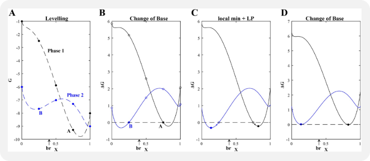
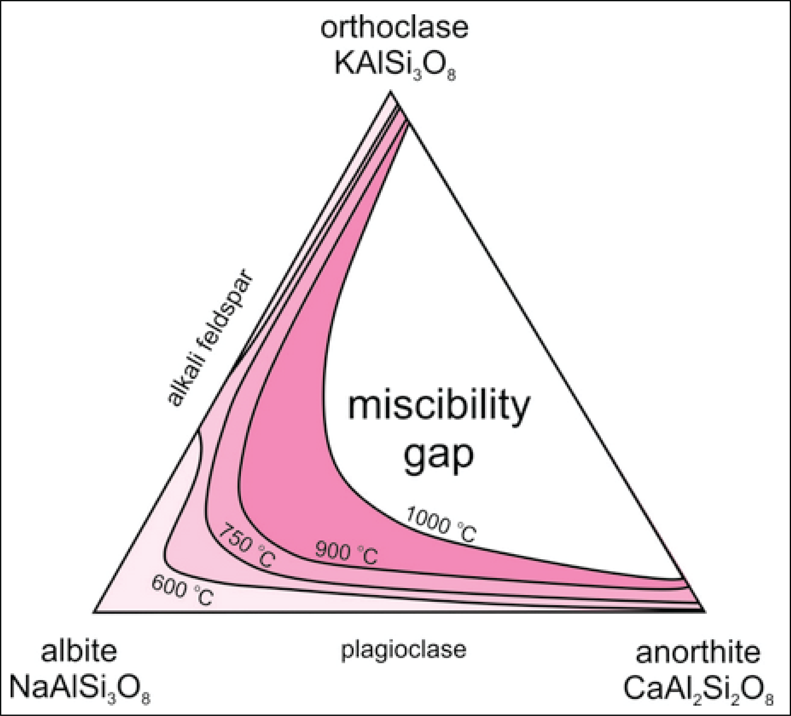

## Problem Definition {#Problem-Definition}

Finding the most stable phase assemblage is a challenging constrained optimization problem including both equality and inequality constraints. One has to minimize the Gibbs energy (1) of the system while satisfying the Gibbs-Duhem (2) and mass equality constraints (3) while also satisfying the mixing-in-sites inequality constraints (4).

### 1. Total Gibbs Energy {#1.-Total-Gibbs-Energy}

The Gibbs energy of a multi-component multiphase system is given by the weighted summation of the chemical potentials of all end-members and pure phases:

$$\begin{align}
G_{sys} = \sum_{\lambda=1}^{\Lambda} n_{\lambda} \sum_{i=1}^{N_{\lambda}} \mu_{i}(\lambda) p_{i}(\lambda) + \sum_{\omega=1}^{\Omega} n_{\omega} \mu_{\omega}
\end{align}$$

where $n_{\lambda}$ is the molar fraction of the solution phase, $p_{\lambda}$ is the molar fraction of the endmembers, and $n_{\omega}$ is the molar fraction of the pure phase.

The chemical potential of a phase is either a constant for a condensed (pure) phase:

$$\begin{align}
\mu_{i} = G_{i}^{0}
\end{align}$$

or a function for a phase within a solution:

$$\begin{align}
\mu_{i} = G_{i}^{0} + RT\log(a_{i}) + G_{i}^{ex}
\end{align}$$

where $a_{i}$ is the thermochemical activity related to the mole fraction and the activity coefficient by:

$$\begin{align}
a_{i} = x_{i} \gamma_{i}
\end{align}$$

For the case of ideal mixing between the end-members, the activity coefficient is unity. The mixing of a species dissolved in a condensed phase, however, rarely behaves ideally and is typically a function of both temperature and composition (mixing-on-sites formulation).

### 2. Gibbs-Duhem Constraint {#2.-Gibbs-Duhem-Constraint}

The Gibbs-Duhem constraint is defined as:

$$\begin{align}
\sum_{j=1}^{C} \Gamma_{j} a_{ij} - \mu_{i} = 0
\end{align}$$

where $\Gamma_{j}$ is the chemical potential of pure component (oxide) $j$ and $a_{ij}$ is the molar composition of component $j$ in end-member/pure phase $i$.

### 3. Mass Constraint {#3.-Mass-Constraint}

The mass equality constraint is defined as:

$$\begin{align}
\sum_{\lambda=1}^{\Lambda} n_{\lambda} \sum_{i=1}^{N_{\lambda}} a_{ij}(\lambda) p_{i}(\lambda) + \sum_{\omega=1}^{\Omega} n_{\omega} a_{\omega j} - b_j = 0
\end{align}$$

where $a_{ij}$ is the molar composition of component $j$ in end-member $i$, and $a_{\omega j}$ is the molar composition of component $j$ in a pure phase.

## Minimization Approach {#Minimization-Approach}

The Gibbs minimization approach employed in MAGEMin combines discretization of the equations of state in composition space with linear programming and extends the mass-constrained Gibbs-hyperplane rotation method to account for the mixing-on-sites that takes place in silicate mineral solid solutions. For an exhaustive description of the methodology, see Riel et al. (2022).

  


## Algorithm Demonstration {#Algorithm-Demonstration}

A simplified example of the Gibbs energy minimization approach used in MAGEMin is provided at:

[GitHub Repository](https://github.com/ComputationalThermodynamics/SandBox/blob/main/PhaseEquilibriumMinimizer/MAGEMin_PGE_and_LP.m)

This MATLAB application includes two pure phases, sillimanite and quartz, and activity-composition (a-x) relations for feldspar (pl4T, Holland et al., 2021) in a reduced Na2O-CaO-K2O-Al2O3-SiO2 (NCKAS) chemical system.

## Solvus phase naming {#Solvus-phase-naming}

A solvus is a boundary that defines the limit of solid solubility (miscibility) of phases described by the same solution model (or a-x model). It separates a single solid phase from a region where two (or more) distinct solid phases coexist due to compositional differences.

  


Properly naming demixed phases is important as it allows to differentiate multiple stable instances of the same solution model e.g., plagioclase and alkali-felspar (feldspar) or muscovite and paragonite (muscovite) etc. While for some solution models, naming (or classifying) the demixed phases is relatively straigthforward (e.g., for feldspar) for other solution phases, such as amphibole, the classification rules are more complex and sometimes not fully accurate.

### Igneous, igneous alkali dry (ig, igad) {#Igneous,-igneous-alkali-dry-ig,-igad}

x = SS_vec.compVariables
- spinel: `spl`
  

```julia
if x[3] - 0.5 > 0.0;        mineral_name = "cm"
elseif x[4] - 0.5 > 0.0;    mineral_name = "usp"
elseif x[2] - 0.5 > 0.0;    mineral_name = "mgt"
else                        mineral_name = "spl"
```

- feldspar: `fsp`
  

```julia
if x[2] - 0.5 > 0.0;        mineral_name = "afs"
else                        mineral_name = "pl"; 
```

- muscovite: `mu`
  

```julia
if x[4] - 0.5 > 0.0;        mineral_name = "pat"
else                        mineral_name = "mu"
```

- amphibole: `amp`
  

```julia
if x[3] - 0.5 > 0.0;        mineral_name = "gl"
elseif -x[3] -x[4] + 0.2 > 0.0;   mineral_name = "act"
else
    if x[6] < 0.1;          mineral_name = "cumm"
    elseif -1/2*x[4]+x[6]-x[7]-x[8]-x[2]+x[3]>0.5;      mineral_name = "tr"    
    else                    mineral_name = "amp"
```

- ilmenite: `ilm`
  

```julia
if -x[1] + 0.5 > 0.0;       mineral_name = "hem"
else                        mineral_name = "ilm"
```

- nepheline: `nph`
  

```julia
if x[2] - 0.5 > 0.0;       mineral_name = "K-nph"
else                        mineral_name = "nph"
```

- clinopyroxene: `cpx`
  

```julia
if x[3] - 0.6 > 0.0;        mineral_name = "pig"
elseif x[4] - 0.5 > 0.0;    mineral_name = "Na-cpx"
else                        mineral_name = "cpx"
```


### metapelite, metabasite, ultramafic (mp, mb, um, mpe, mbe, ume) {#metapelite,-metabasite,-ultramafic-mp,-mb,-um,-mpe,-mbe,-ume}

x = SS_vec.compVariables
- feldspar: `fsp`
  

```julia
if x[2] - 0.5 > 0.0;        mineral_name = "afs"
else                        mineral_name = "pl"; 
```

- muscovite: `mu`
  

```julia
if x[4] - 0.5 > 0.0;        mineral_name = "pat"
else                        mineral_name = "mu"
```

- spinel: `sp`
  

```julia
if x[2] - 0.5 > 0.0;        mineral_name = "sp"
else                        mineral_name = "mt"
```

- amphibole: `amp`
  

```julia
if x[3] - 0.5 > 0.0;        mineral_name = "gl"
elseif -x[3] -x[4] + 0.2 > 0.0;   mineral_name = "act"
else
    if x[6] < 0.1;          mineral_name = "cumm"
    elseif -1/2*x[4]+x[6]-x[7]-x[8]-x[2]+x[3]>0.5;      mineral_name = "tr"    
    else                    mineral_name = "amp"
```

- ilmenitem: `ilmm`
  

```julia
if x[1] - 0.5 > 0.0;        mineral_name = "ilmm"
else                        mineral_name = "hemm"
```

- ilmenite: `ilm`
  

```julia
if 1.0 - x[1] > 0.5;        mineral_name = "hem"
else                        mineral_name = "ilm"
```

- diopside: `dio`
  

```julia
if x[2] > 0.0 && x[2] <= 0.3;       mineral_name = "dio"
elseif x[2] > 0.3 && x[2] <= 0.7;   mineral_name = "omph"
else                                mineral_name = "jd"
```

- diopside: `occm`
  

```julia
if x[2] > 0.5;              mineral_name = "sid"
elseif x[3] > 0.5;          mineral_name = "ank"
elseif x[1] > 0.25 && x[3] < 0.01;         mineral_name = "mag"
else                        mineral_name = "cc"
```

- ortho-amphibole: `oamp`
  

```julia
if x[2] < 0.3;              mineral_name = "anth"
else                        mineral_name = "ged"
```


### List of mineral abbreviations (for solvus) {#List-of-mineral-abbreviations-for-solvus}

|    Acronym |         Full Mineral Name |
| ----------:| -------------------------:|
|        act |                Actinolite |
|        afs |           Alkali Feldspar |
|        amp |                 Amphibole |
|        ank |                  Ankerite |
|       anth |             Anthophyllite |
|         cc |                   Calcite |
|         cm |                  Chromite |
|        cpx |             Clinopyroxene |
|       cumm |             Cummingtonite |
|        dio |                  Diopside |
|        fsp |                  Feldspar |
|        ged |                   Gedrite |
|         gl |               Glaucophane |
|   hem/hemm |                  Hematite |
|   ilm/ilmm |                  Ilmenite |
|         jd |                   Jadeite |
|      K-nph |        Potassic Nepheline |
| mt/mgt/mag |                 Magnetite |
|         mu |                 Muscovite |
|        nph |                 Nepheline |
|     Na-cpx |      Sodium Clinopyroxene |
|       occm | Carbonate (calcite group) |
|       oamp |           Ortho-amphibole |
|       omph |                 Omphacite |
|        pat |                Paragonite |
|        pig |                 Pigeonite |
|         pl |               Plagioclase |
|        sid |                  Siderite |
|     sp/spl |                    Spinel |
|         tr |                 Tremolite |
|        usp |                Ulvöspinel |


## References {#References}
- Holland, T. J. B., Green, E. C. R., &amp; Powell, R. (2021). A thermodynamic model for feldspars in KAlSi3O8-NaAlSi3O8-CaAl2Si2O8 for mineral equilibrium calculations.
  
- Riel N., Kaus B.J.P., Green E.C.R., Berlie N., (2022) MAGEMin, an Efficient Gibbs Energy Minimizer: Application to Igneous Systems. _Geochemistry, Geophysics, Geosystems_ 23, e2022GC010427 [https://doi.org/10.1029/2022GC010427](https://doi.org/10.1029/2022GC010427)
  
