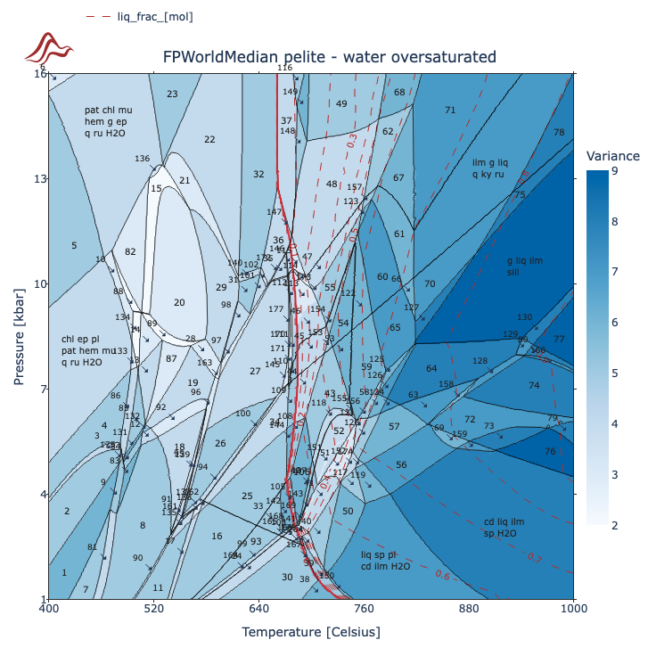
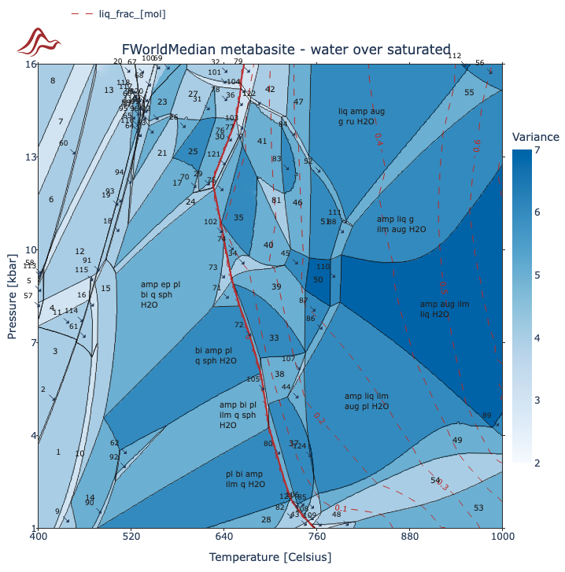
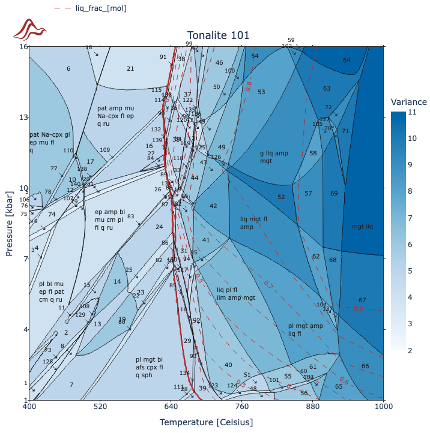
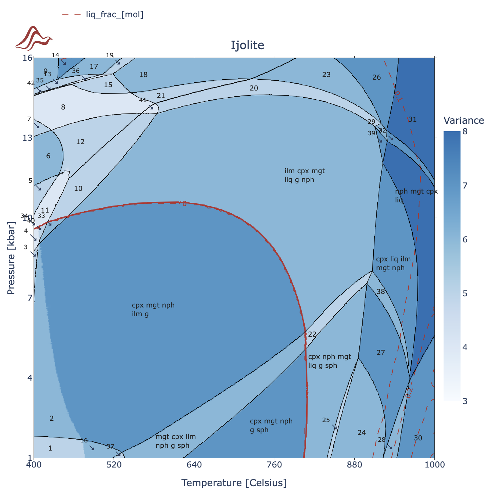
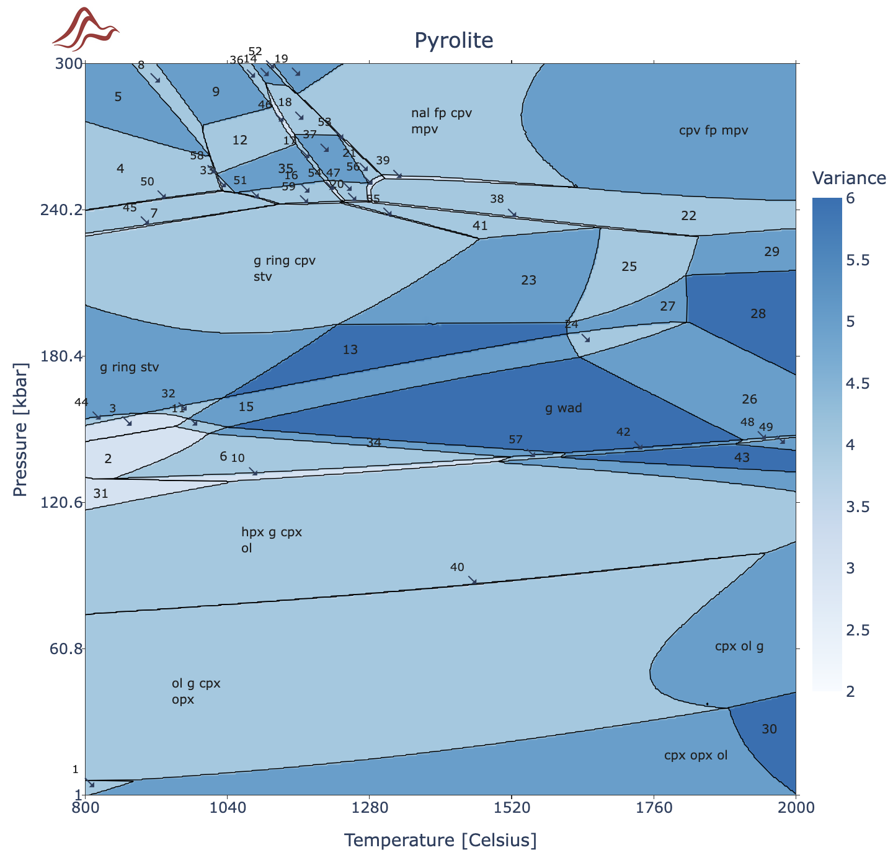

```@raw html

```

## MAGEMinApp.jl

[MAGEMinApp.jl](https://github.com/ComputationalThermodynamics/MAGEMinApp.jl) provides an easy-to-use web-based graphical user interface to compute efficiently a whole range of phase diagrams and more.

## Features

```@raw html
<ul>
    <li>Pressure-Temperature iso-chemical phase diagrams (P-T phase diagrams)</li>
    <li>Pressure and/or Temperature versus variable composition diagrams (P-X, T-X, PT-X, T-T polymetamorphic phase diagrams)</li>
    <li>Trace-element partitioning at suprasolidus conditions (includind models of Zr saturation)</li>
    <li>Display iso-contour of phase fractions, densities, seismic velocities etc.</li>
    <li>Automatic labeling of the phase fields including listing the stable phase assemblage when the field is too small.</li>
    <li>Pressure-Temperature-Composition paths e.g., fractional melting and crystallization (with assimilation and extraction threshold).</li>
    <li>Isentropic paths</li>
    <li>Save generated diagrams/figures as vector files (svg format).</li>
    <li>Export single point and whole grid information as `csv` files</li>
</ul>
```
## MAGEMinApp examples

:::tabs

== F-World-Median metapelite (W14)

```@raw html

```

P-T phase diagram produced using the metapelite dataset (White et al., 2014) using fixed composition. The `liq` reaction line is highlighted and the `liq` fraction is contoured using a step of 0.1 mol fraction`.

== F-World-Median metabasite (G16)

```@raw html

```

P-T phase diagram produced using the metabasite dataset (Green et al., 2016) using fixed composition. The `liq` reaction line is highlighted and the `liq` fraction is contoured using a step of 0.1 mol fraction`.

== Tonalite 101 (G25-HP18)

```@raw html

```

P-T phase diagram produced using the Igneous dataset (Green et al., 2015 udpated from Holland et al., 2018) using fixed composition. The `liq` reaction line is highlighted and the `liq` fraction is contoured using a step of 0.1 mol fraction`.

== Ijolite (W24)

```@raw html

```

P-T phase diagram produced using the Igneous alkaline dry dataset (Weller et al., 2024) using fixed composition. The `liq` reaction line is highlighted and the `liq` fraction is contoured using a step of 0.1 mol fraction`.

== Pyrolite (H13)

```@raw html

```

P-T phase diagram produced using the Igneous dataset (Holland et al., 2013) using fixed composition.

:::

## [Available thermodynamic database](@id thermodynamic_database)

:::tabs

== Metapelite (W14)

The metapelitic model (extended with MnO, White et al., 2014) allows to compute the mineral assemblage from low temperature to supra-solidus conditions.

```@raw html
<ul>
    <li>Added March 2023, `MAGEMin v1.3.0`</li>
    <li>White et al., 2014a, 2014b (see http://hpxeosandthermocalc.org)</li>
    <li>K2O-Na2O-CaO-FeO-MgO-Al2O3-SiO2-H2O-TiO2-O-MnO chemical system</li>
    <li>Pure stoichiometric phases quartz (q), cristobalite (crst), tridymite (trd), coesite (coe), stishovite (stv), kyanite (ky), sillimanite (sill), andalusite (and), rutile (ru) and sphene (sph).</li>
    <li>Solution phases spinel (spl), biotite (bi), cordierite (cd), orthopyroxene (opx), epidote (ep), garnet (g), ilmenite (ilm), silicate melt (liq), muscovite (mu),  ternary feldspar (pl4T), sapphirine (sa), staurolite (st), magnetite (mt), chlorite (chl), chloritoid (ctd) and margarite (ma).</li>
</ul>
```

== Ultramafic (EF21)

```@raw html
<ul>
    <li>Added May 2023, `MAGEMin v1.3.2`</li>
    <li>Evans & Frost, 2021 (see http://hpxeosandthermocalc.org)</li>
    <li>SiO2-Al2O3-MgO-FeO-O-H2O-S chemical system</li>
    <li>Pure stoichiometric phases quartz (q), cristobalite (crst), tridymite (trd), coesite (coe), stishovite (stv), kyanite (ky), sillimanite (sill), pyrite (pyr).</li>
    <li>Solution phases fluid (fluid), olivine (ol), brucite (br), antigorite (atg), garnet (g), talc (t), chlorite (chl), spinel (spi), orthopyroxene (opx), pyrrhotite (po) and anthophylite (anth).</li>
</ul>
```

== Metabasite (G16)

```@raw html
<ul>
    <li>Added October 2023, `MAGEMin v1.3.5`</li>
    <li>Green et al., 2016 (see http://hpxeosandthermocalc.org)</li>
    <li>K2O-Na2O-CaO-FeO-MgO-Al2O3-SiO2-H2O-TiO2-O chemical system</li>
    <li>Pure stoichiometric phases quartz (q), cristobalite (crst), tridymite (trd), coesite (coe), stishovite (stv), kyanite (ky), sillimanite (sill), andalusite (and), rutile (ru) and sphene (sph).</li>
    <li>Solution phases spinel (sp), biotite (bi), orthopyroxene (opx), epidote (ep), garnet (g), ilmenite (ilm), silicate melt (liq), muscovite (mu),  ternary feldspar (pl4T), chlorite (chl), Omphacite(omph), Augite(aug) and clino-amphibole (amp).</li>
</ul>
```

== Mantle (H13)

```@raw html
<ul>
    <li>Added October 2024,`MAGEMin v1.5.5`</li>
    <li>Holland et al., 2013 (see https://academic.oup.com/petrology/article/54/9/1901/1514886)</li>
    <li>Na2O–CaO–FeO–MgO–Al2O3–SiO2 (NCFMAS) system</li>
    <li>Pure stoichiometric phases quartz (q), cristobalite (crst), tridymite (trd), coesite (coe), stishovite (stv), kyanite (ky), sillimanite (sill) and andalusite (and).</li>
    <li>Solution phases garnet (g), clinopyroxene (cpx), orthopyroxene (opx) and its high-P polymorph (hpx), olivine (ol), wadsleyite (wad), ringwoodite (ring), akimotoite (ak), MgSi-perovskite (mpv), CaSi–perovskite (cpv), cf, nal, corundum (cor) and ferropericlase (fp)</li>
</ul>
```

== Igneous (G25-HP18)

```@raw html
<ul>
    <li>Added December 2024,`MAGEMin v1.6.2`</li>
    <li>Green et al., 2025, corrected from Holland et al., 2018 (see http://hpxeosandthermocalc.org)</li>
    <li>K2O-Na2O-CaO-FeO-MgO-Al2O3-SiO2-H2O-TiO2-O-Cr2O3 chemical system</li>
    <li>Pure stoichiometric phases quartz (q), cristobalite (crst), tridymite (trd), coesite (coe), stishovite (stv), kyanite (ky), sillimanite (sill), andalusite (and), rutile (ru) and sphene (sph).</li>
    <li>Solution phases spinel (spl), biotite (bi), cordierite (cd), clinopyroxene (cpx), orthopyroxene (opx), epidote (ep), garnet (g), clino-amphibole  (amp), ilmenite (ilm), silicate melt (liq), muscovite (mu), olivine (ol), ternary feldspar (pl4T), and aqueous fluid (fl).</li>
</ul>
```

== Igneous alkaline (W24)

```@raw html
<ul>
    <li>Added December 2024,`MAGEMin v1.6.2`</li>
    <li>Weller et al., 2024 (see doi:10.1093/petrology/egae098)</li>
    <li>K2O-Na2O-CaO-FeO-MgO-Al2O3-SiO2-TiO2-O-Cr2O3 chemical system</li>
    <li>Pure stoichiometric phases quartz (q), cristobalite (crst), tridymite (trd), coesite (coe), stishovite (stv), kyanite (ky), sillimanite (sill), andalusite (and), rutile (ru) and sphene (sph). </li>
    <li>Solution phases spinel (spl), clinopyroxene (cpx), orthopyroxene (opx), garnet (g), ilmenite (ilm), silicate melt (liq), olivine (ol), ternary feldspar (pl4T), Nepheline (ness), Kalsilite (kals), Leucite (lct) and Melilite (mel).</li>
</ul>
```

:::

!!! note
    Please keep in mind that the datasets are only calibrated for a limited range of `P`,`T` and `bulk rock` conditions. If you go too far outside those ranges, `MAGEMin` (or most other thermodynamic software packages for that matter) may not converge or give bogus results. Developing new, more widely applicable, thermodynamic datasets is a huge research topic, which will require funding to develop the models themselves, as well as to perform targeted experiments to calibrate those models.
