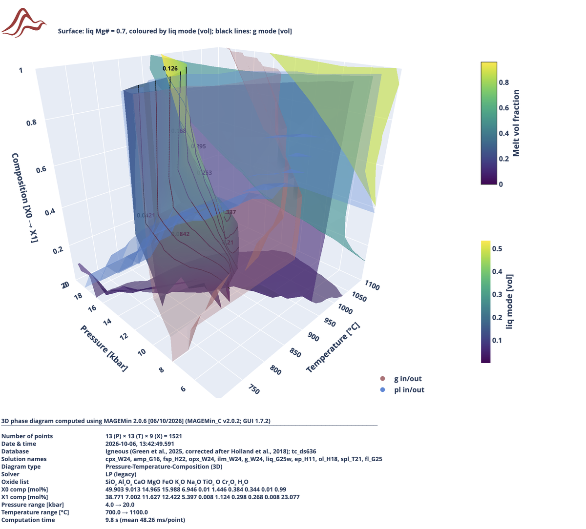

```@raw html

```

## Phase diagrams tutorials (MAGEMinApp v0.8.6)

Here we provide a set of tutorials to generate various kind of phase diagrams, compute trace-element partitioning and Zr saturation, post-process the results, display various fields, reaction lines and iso-contours, and, export data and save the diagrams as `svg` graphic vector files.


!!! info
    - [1. First phase diagram](#1.-First-phase-diagram)
    - [2. Reaction lines and isopleths](#2.-Reaction-lines-and-isopleths)
    - [3. Displayed field and colormap options](#3.-Displayed-field-and-colormap-options)
    - [4. Export figures](#4.-Export-figures)
    - [5. Deactivate solution and pure phases](#5.-Deactivate-solution-and-pure-phases)
    - [6. Buffers](#6.-Buffers)
    - [7. Latent heat of reaction](#7.-Latent-heat-of-reaction)
    - [8. Trace element modelling](#8.-Trace-element-modelling)
    - [9. Solidus H2O saturated phase diagram](#9.-Solidus-H2O-saturated-phase-diagram)
    - [10. TX fixed pressure diagram](#10.-TX-fixed-pressure-diagram)
    - [11. PTX diagram](#11.-PTX-diagram)
    - [12. TT poly-metamorphic diagram](#12.-TT-polymetamorphic-diagram)
    - [13. LaMEM density diagram](#13.-LaMEM-density-diagram)
    - [14. Draw a P-T path on the diagram](#14.-Draw-a-P-T-path-on-the-diagram)
    - [15. Quantitative isopleth thermobarometry with IntersecT](#15.-Quantitative-isopleth-thermobarometry-with-IntersecT)
    - [16. μ-μ (chemical potential) diagram](#16.-μ-μ-chemical-potential-diagram)
    - [17. Monte Carlo bulk-rock uncertainty](#17.-Monte-Carlo-bulk-rock-uncertainty)
    - [18. P-T-X 3D diagram](#18.-P-T-X-3D-diagram)

### 1. First phase diagram 

For the first diagram, simply launch `MAGEMinApp` and navigate to the `Setup` sub-tab of the `Phase diagram` tab. Then click on `Compute phase diagram`.

```@raw html

```

In less than one minute you should get the following result (tab `Diagram`):

```@raw html


```

The default field to be displayed is `variance`. Superimposed on it are the reactions lines (in black) and the phase assemblage labels with a list of labels shown on the right in the event the field size are too small. If you scroll down below the figure you can see the informations about the computation:

```@raw html


```

The caption lists useful information such as the version of `MAGEMin` backend, `MAGEMin_C` and `MAGEMinApp`, the activity-composition models, the version of the thermodynamic dataset, the bulk-rock composition and the type of diagram.

!!! note
    The caption is saved together with the figure (as a `svg` file) when clicking on the little camera icon when hovering your mouse on the top-right corner of the figure.

    ```@raw html

    
    ```

!!! note
    The list of mineral assemblage that cannot be directly labeled on the figure is provided in a text area on the right side of the diagram. The list can be copied by clicking on the `Copy` button at the top of the list.

    ```@raw html

    
    ```


#### Grid point information

Stable phase mineral fractions and composition can be accessed for any point of the grid by simply clicking on the figure. Doing so will load a pie chart on the right panel in the `informations` tab:

```@raw html


```

clicking on a mineral of the pie chart will display it's composition:

```@raw html


```


#### Refine diagram

In the top-right corner of the figure, there is two buttons allowing you to refine the phase diagram (increase its resolution) using adaptive mesh refinement. 

```@raw html


```

Click on `Refine phase boundaries` and observe the top-right corner of the App where the progress bar is indicating the number of new points to be computed and the remaining time to completion.

```@raw html


```

After 2 refinements the updated diagram should look much finer:

```@raw html


```

On the right panel, selecting `Display options` can allow you display the adaptive refinement grid by setting `Show grid` to `true`:

```@raw html


```

which results in:

```@raw html


```

!!! note
    - The size of the cells is decreasing as you get near a reaction line. Here, we use phase boundary as the condition for adaptive mesh refinement but other conditions can be used e.g., dominant endmember fraction.
    - Uniform refinement adds new points uniformily and not only near reaction lines.

#### Exporting data

There is two main phase equilibrium data that can be exported: point wise (when clicking on a grid point of the phase diagram) and all points (the full phase diagram).

```@raw html


```

To export single point data, first click on any point of the grid, then modify the name the file and click on the `Table` or `Text` button right next to `Save point`. For saving all point information, simply provide a filename next to `Save all` and click on `csv file`.

!!! note
    - `Table` saves the whole output of the stable phase equilibrium while `Text` saves general information.
    - Single point data are downloaded through the web-browser and are likely to end up in your `Downloads` directory.
    - Save all points data will end up in the directory indicated in the `Setup` tab and `General parameters` panel.
    - Mind that when saving all points, the size of file can quickly becomes large (> Go) if the total number of the phase diagram is also large!

### 2. Reaction lines and isopleths

#### Reaction lines

Using the previously computed KLB-1 phase diagram, let's now change the `liq` in reaction line and add isocontours for `melt` fraction. First make sure you are in the `Diagram` sub-tab and that you have the `Display options` panel selected (on the right).

```@raw html


```

In the `Diagram options` of the `Display options` panel, change the selected phase from `ol` to `liq`, then change the line width to 2.0 and the color to red. To display the reaction line, simply click on `Save` then `Update`:

```@raw html


```

which should update the phase diagram as follow:


```@raw html


```

#### Isopleths

To add isopleths (isocontour), first change the selected right panel from `Display options` to `Isopleths`, then choose `Isopleth type = solution phase`, `Phase = liq`, `Field = mode` and `Unit = wt`. Use the default `Range`values and set `Line style = dash` and color to red. Finally click on the `Add` button:

```@raw html


```
which gives:

```@raw html


```

Let's now add isocontour for the `Mg#` of the `liq`. Change `Field = mode` to `Field = Calculator apfu` which allow you to generate custom atom per formule unit isocontours. In the newly displayed option `Calculator (apfu)` keep the default value `Mg / (Mg + Fe)`. Then change the `Range` `Step`to 0.01 and the line style and color to your liking:

```@raw html


```

which gives:

```@raw html


```

!!! note
    You can manage the isopleths, such as showing/hidding/deleting them in the bottom section of the `Isopleths` panel:

    ```@raw html

    
    ```

### 3. Displayed field and colormap options

You can change the field displayed on the phase diagram by selecting the `Display options` panel and, for instance, change `Field = Variance` to `Field = log10(dQFM)` which will display the $\Delta_{QFM}$ in the $RTlog()$ scale. By default the field will be displayed using the `Blues`colormap such as for variance. This can be changed in the `Color options` section located at the bottom of the `Display options` panel:

```@raw html


```

For instance, change `Colormap = Blues` to `Colormap = RdBu` and the `Colormap range` from 1-7 to 1-9:

```@raw html


```

which results in

```@raw html


```

### 4. Export figures

Pseudosections, including isopleths and reaction lines can be exported to `svg` by clicking on the little Camera at the top-right of the diagram:

```@raw html


```

However, this option merges all the layers together making it difficult to post-process the figures efficiently in any graphic vector software such as `Inkscape` or `Illustrator`. 

A alternative way to export all layers individually is to use the `Export all layers` option:

```@raw html


```

Using the `Export all layers` option will generate a list of `svg` files in the `output` directory of MAGEMinApp:

```@raw html


```

This includes the displayed field (heatmap), the reactions lines, the labels of the phase equilibria (vector and text), a vector file per iso-contour and the iso-contour legends.

Which gives for instance:

```@raw html


```

```@raw html


```

```@raw html


```

### 5. Deactivate solution and pure phases

In some cases, it is useful to deactivate a solution model (activity-composition model) or a pure phase. 

Let's first select the thermodynamic database to be `Metapelite` (White et al., 2014) and use the default bulk-rock composition `FPWorldMedian pelite - water oversaturated`. Keep the default diagram type `P-T Diagram` and pressure range and update the temperature range from 400 to 1000 °C. in the top-left `Phase diagram parameters` panel, simply click on the rounded button of the `Phase selection` option, to display the list of available phases for the selection thermodynamic database:


```@raw html


```

Once the `Phase selection` panels are unfolded you can provide your custom selection of phases. For instance let's unselect `liq`, `mt` and `ilmm`, and then perform the calculation. Refining the phase diagram twice gives:

```@raw html


```

!!! note
    - Here, the solution models `liq`, `mt` and `ilmm` are deactivated. However, you can see the phase `mt` appearing for instance in the large LP-HT (`cd`+`pl`+`afs`+`ilm`+`mt`+`q`+`H2O`) field. This is because the `sp` model can also produce `mt` compositions.

!!! warning
    - When all `Solution phase` are selected, the default combination of phases for the activity-composition set will be applied. In the case of the `Metapelite` thermodynamic database the default combination fir spinel and ilmenite is `sp` and `ilm`.
    - As soon as one solution model is unselected the default combination is deactivated. This implies that you manually have to select which combination of phase you want and make sure you are not using 2 spinel or 2 ilmenite models at the same time!

### 6. Buffers

Several buffers can be used to fix the oxygen fugacity
- `qfm` -> quartz-fayalite-magnetite
- `qif` -> quartz-iron-fayalite
- `nno` -> nickel-nickel oxide
- `hm` -> hematite-magnetite
- `iw` -> iron-wüstite
- `cco` -> carbon dioxide-carbon

Similarly activity can be fixed for the following oxides
- `aH2O` -> using water as reference phase
- `aO2`   -> using dioxygen as reference phase
- `aMgO` -> using periclase as reference phase
- `aFeO` -> using ferropericlase as reference phase
- `aAl2O3` -> using corundum as reference phase
- `aTiO2` -> using rutile as reference phase
- `aSiO2` -> using quartz/coesite as reference phase

Let's compute a P-T diagram using the `qfm` buffer. For instance, select the thermodynamic database to be `Metabasite` (Green et al., 2016). Choose the pressure-temperature range of your choice. Select `SQA synthethic amphibolitic composition` in the middle `Bulk-rock composition` panel, then in the `Phase diagram parameters` left panel, select `Buffer = QFM`. Finally, make sure you saturate the bulk-rock in `O` by changing the value to 3.0:

```@raw html


```

Which gives, after 4 levels of refinements:

```@raw html


```

!!! note
    - If you click on any point of the diagram, you can see in the `Informations` panel, that every field contain a `qfm` phase. This phase has a fraction equal to 0.0 and simply shows that the system is buffered. 
    - If one of the field does not have the buffer phase, it indicates that not enough free `O` has been provided.

    ```@raw html

    
    ```

!!! warning
    - The `Buffer offset` option in the `Bulk-rock composition` panel is used to offset the oxygen buffer in the $RT log()$ scale, while for activity it serves as the activity value.

### 7. Latent heat of reaction

Heat capacity is computed as a second order derivative of the Gibbs energy with respect to temperature using numerical differentiation.

\$C_p = -T \\frac{\\partial ^2G}{\\partial T^2}\$

**There is however two ways to retrieve the second order derivative:**
  1. Default option `Specific Cp = G0` - no latent heat of reaction: Fixing the phase assemblage (phase proportions and compositions) and computing the Gibbs energy of the assemblage at T, T+eps and T-eps.
  2. Full differentiation option `Specific Cp = G_system` - latent heat of reaction: Computing three stable phase equilibrium at T, T+eps and T-eps.

!!! note
    - While the first method is computationally more efficient, it does not account for the latent heat of reaction. When having correct heat budget is important it is therefore recommanded to employ the second approach.

To compute a phase diagram that takes into account latent heat reaction simply choose `Specific Cp = G_system` in the `Phase diagram parameters` panel:

```@raw html


```

Using the metapelite database and the `FPWorldMedian pelite - oversaturated` composition and 4 levels of refinement, together with displaying s_cp (and capping max value to 4000 for the colormap) gives:

```@raw html


```

!!! note
    - Without accounting for latent heat of reaction (`Specific Cp = G0`), the values of the specific heat capacity are drastically different:

    ```@raw html

    
    ```


### 8. Trace element modelling

Let's predict trace-element partitioning together with a new phase diagram using the metapelite database (White et al., 2014) and the pre-defined World Median Pelite oversaturated.

::: details

- Thermodynamic database -> Metapelite
- Diagram type -> P-T diagram
- TE predictive model -> true
- Pressure -> 0.01 to 10.0 kbar
- Temperature -> 300.0 to 1000.0 °C
- Initial grid subdivision -> 4
- Refinement levels -> 4
- Trace-element composition panel -> select default `tonalite`

:::

```@raw html


```

Which after performing the calculation should result in:

```@raw html


```

Now move to the `Trace-elements` sub-tab, and to load the trace-element prediction, click on the button `Load/Reload trace-elements`. Doing so will display the default field `Sat_zr_liq`, which is the computation saturation level of liquid for zirconium in `ug/g`. To change the displayed field navigate to the `Display options` panel on the right side and choose `Field type = Trace element` ansd click `Compute and display`.

```@raw html


```

which will display (using default options) the ratio $Dy_melt / Yb_melt$:


```@raw html


```

To make the melt-free transparent in colormap, you can change in the `Color options` section of the `Display options` panel `Set min to white = true` which yields:


```@raw html


```

#### Display trace-element spectrum

In order to display trace-element spectrum from any suprasolids point of the computed grid, simply click on the grid. Doing so will display a spectrum in the figure right above the trace-element diagram:


```@raw html


```

!!! tip
    - In the trace-element spectrum panel, you can change the display elements from `ree` to `all` and change the normalization method  from `bulk`to `chondrite`.
    - As for other `MAGEMinApp`figures, you can export the spectrum by hovering your cursor in the top-right corner of the figure and clikc on the small camera icon. This will save an `*.svg` vector graphic file.
    - Double-clicking on a phase abbreviation on the right legend of the spectrum will isolated the selected spectrum:

    ```@raw html

    
    ```

### 9. Solidus H2O saturated phase diagram

To compute solidus H₂O-saturated phase diagram, let's (for instance) change the thermodynamic database to Metabasite (Green et al., 2016), choose `Solidus H₂O-saturated = true`, select `clinopyroxene = aug`:

```@raw html


```

in the middle `Bulk-rock conmposition` panel, select `SM89 oxidised average MORB composition` and change the water-content from 20.0 to 40.0 to ensure water-saturation

```@raw html


```

Computing the diagram and displaying the system H₂O-activity should gives:

```@raw html


```

!!! note
    - First, for the given pressure range (and using 50 pressure steps), the water-saturated solidus is extracted using bisection method. Subsequently, the pressure-dependent solidus temperature is interpolated using PChip interpolant. At Tsuprasolidus = Tsolidus + 0.01 K, a second interpolation is used to retrieve the amount of water saturating the melt. The latter interpolant is then used to prescribe the water content of the bulk, ensuring pressure-dependent water saturation at solidus (+ 0.1 K). 
    - Extra water can be added in the `Phase diagram parameter` panel, using the option `Additional H₂O [mol%]`.

### 10. TX fixed pressure diagram

The objective of T-X diagram is to fix the pressure while having in the vertical axis a range of temperature and on the horizontal axis a varying bulk-rock composition. Variation in the bulk-rock composition can be applied to any oxides and the two end-member bulk-rock composition added to bulk-rock input file (see [Bulk-rock input file](@ref)).

To compute a T-X with fixed pressure diagram, simply select in the `Setup` sub-tab `Diagram = T-X diagram`. For instance, choose the `Igneous alkaline dry` thermodynamic database (Weller et al., 2024) and change the temperature range to 600 - 1200 °C. Keep the default fixed pressure at 10.0 kbar:

```@raw html


```

In the middle `Bulk-rock composition` panel select the predefined `Ijolite` bulk composition for the left table, and the `Ne-Syenite` bulk composition for the right table.

```@raw html


```

Compute the diagram with `Initial grid subdivision = 5` and `Refinement levels = 3`:

```@raw html


```

!!! note
    - Some of the reaction lines in the high temperature part of the diagram are not perfectly clean. This problem is related to the use of the `Boost mode` which uses the results of the previous refinement level as an initial guess for the next level. 
    - In this case, performing the calculation with `Boost mode = false` fixed the problem:

    ```@raw html

    
    ``` 
!!! tip
    - In some cases, when `Boost mode = true`, the produced diagram will display some poorly resolved reaction lines. To fix this you can either increase the initial grid subdivision `Initial grid subdivision = 5` or set  `Boost mode = false`.


#### T-X buffer

Previously we changed the composition from `Ijolite` to `Ne-Syenite`. Let's instead vary the `qfm` buffer offset for `Ijolite` composition from -5 to 5.

In the `Phase diagram parameters` left panel, select `Buffer = QFM`, then in the middle `Bulk-rock composition` panel, select `Ijolite` for both left and right composition. Then change `Buffer offset` to -5 for the left entry, and to 5 for the right entry. Don't forget to increase the `O` content, for isntance to 3.0:

```@raw html


``` 

Which after 4 levels of refinements results in:

```@raw html


``` 

!!! warning 
    - Here, you can see that we did not provide enough `O` as `qfm` phase does not appear on the right side of the diagram. You can easely fix that by change the `O` value to 10 and relaunch the calculation

Fixing the `O` content and contouring $\Delta_{QFM}$ gives the desired result:

```@raw html


``` 

### 11. PTX diagram

PT-X diagrams differ from P-X and T-X diagrams in the sense that both pressure and temperature can be varied along a pressure-temperature path. This option can be particularily useful when modelling subduction geotherm for instance.

To perform a PT-X diagram, let's first select the `Metapelite` database (White et al., 2014) and set `Diagram type = PT-X diagram`. When `PT-X diagram` is selected, a new panel with a list of pressure-temperature points becomes available. Let us define a few point as to roughly simulate a subduction pressure-temperature path:

| Pressure | Temperature |
|----------|-------------|
|0.1| 300.0 |
|10.0| 400.0|
|20.0| 550.0 |

Your `Phase diagram parameter` left panel should look like:


```@raw html


``` 

Then in the `Bulk-rock composition` middle panel, select the pre-defined bulk `FPWorldMedian pelite undersaturated` for the left table and `FPWorldMedian pelite oversaturated` for the right table. Select `Refinement levels = 4` then compute the diagram:

```@raw html


``` 

#### Load a P-T path from file (MAGEMinApp v1.6.3)

Instead of entering pressure-temperature points one by one with `Add new point`, you can drag and drop a CSV file directly onto the `Drag and drop path` box below the path table to define (and replace) the whole path in one go. The file needs a header line `P;T` (or `P,T`), with pressure always given in kbar regardless of the app's current pressure-unit setting (kbar/GPa) - it is converted for display automatically. Lines starting with `#` are treated as comments. For example:

```
P;T
0.1;300
10.0;400
20.0;550
```

A ready-to-use example reproducing the subduction path above is shipped as `examples/pt-path.csv` in `MAGEMinApp`.

!!! note
    - Loading a file **replaces** all rows currently in the P-T path table.

### 12. TT polymetamorphic diagram

The goal of a T-T poly-metamorphic diagram is to predict the evolution of the stable phase assemblage for a rock undergoing two successive metamorphic events. 

During the first metamorphic event, the starting bulk-rock composition is used to compute the first stable phase equilibrium at the minimum temperature (and given fixed pressure). In the event free water is predicted, it is removed from the bulk, so that the system become water-saturated. This is repeated for every temperature step until reaching the provided maximum temperature. In a similar manner, when crossing the solidus, melt can be removed according to two options:
- `Liq extract threshold [vol%]` which is the threshold in `vol%` over which `liq` will extracted.
- `Remaining liq fraction [vol%]` which the volume of `liq` left after extraction.

!!! note
    - `Liq extract threshold [vol%]` and `Remaining liq fraction [vol%]` can both be set for metamorphic event 1 and 2.
    - Make sure your starting bulk-rock composition is water oversaturated.

Let's try it out! First, select the `Metabasite` database (Green et al., 2016) and the `FWorldMedian metabasite oversaturated` pre-defined composition. Then `Diagram type = T-T (poly-metamorphic)`, and `clinopyroxene = Augite`. You can keep the default values for the fixed pressure (10.0 kbar) and the temperature range of metamorphic events 1 and 2 (400 - 1000 and 400 - 1000 °C):

```@raw html


``` 

For the first event, you can see that the `Liq extract threshold [vol%]` is set to 7.0 while `Remaining liq fraction [vol%]` is set to 2.0. For the second event `Liq extract threshold [vol%]` is set to 101, which simply deactivate `liq` extraction.

Compute the diagram which should give:

```@raw html


``` 

!!! note
    - At very high temperature extracting nearly all the melt may become a problem as you are left with highly refractory compositions. In this case you either leave slightly more melt in the host-rock or decrease the maximum temperature.

### 13. LaMEM density diagram

#### Quickstart

When computing a density diagram for `LaMEM` geodynamic modelling code, the initial grid setup needs to be changed. Density diagrams for geodynamic modelling generally need to evenly sample the pressure-temperature space of interest and should avoid using refinement. The recommanded mesh configuration in the `Setup` panel is the following.

```@raw html


```

which when displaying the grid and the system density gives:

```@raw html


```

To export the diagram in the format used in LaMEM (`*.in`), simply click on the top-left `Export rho for LaMEM` button!

!!! note
    - Ensure that the thermodynamic you select is calibrated for your pressure-temperature of interest.
    - Make sure the diagram you produce cover the pressure-temperature you expect in your geodynamic simulation. Otherwise `LaMEM` will extrapolate to out of bound regions which may not be what you want!
    - With the above configuration, the total number of computed points will be 4225 which is largely sufficient. Mind that `LaMEM` does not support density diagram with a number of points greater than ~20k.


#### Upper mantle density diagram

When modeling plate-tectonics dynamics, one generally wants to account for phase change in the mantle. To produce a density diagram for the upper mantle you can use the Mantle database (Holland et al., 2012) or `mtl` acronym and the pre-defined `pyrolite` composition. A possible set of pressure-temperature valid for the lithosphere and the asthenosphere is for instance, from 1 to 300 kbar (0.1 to 30 GPa) and from 400 to 2000 °C.

```@raw html


```

This results in the following upper mantle density diagram that can be exported for `LaMEM`

```@raw html


```

### 14. Draw a P-T path on the diagram

The `Draw path` panel (available in the `Diagram` sub-tab, right sidebar) lets you manually trace a P-T path directly on the phase diagram by clicking on grid points, and then generates a stacked area chart of phase fractions along that path.

#### Step 1 - Enable recording

Open the `Draw path` panel on the right sidebar. Toggle `Record` to **on**. The point counter resets to `0 point(s)`.

!!! note
    Recording is automatically disabled when you switch away from the `Draw path` panel.

#### Step 2 - Click points on the diagram

With `Record` active, click on any location of the phase diagram. Each click appends a new row to the path table showing the coordinates of the selected point:

| # | P [kbar] | T [°C] |
|---|---|---|
| 1 | … | … |
| 2 | … | … |
| … | … | … |

- Use `Remove last` to delete the most recently added point.
- Use `Clear` to discard the entire path and start over.


```@raw html


```


!!! note
    For P-X and T-X diagram types the table columns adapt accordingly (`X; P [kbar]` or `X; T [°C]`).

#### Step 3 - Choose the output unit and generate

Select the system unit for the phase fractions plot:

| Unit | Description |
|---|---|
| `mol%` | Molar fractions |
| `wt%` | Weight fractions |
| `vol%` | Volume fractions |

Click `Generate`. MAGEMinApp computes the stable phase equilibrium at each recorded point and displays a stacked area chart titled **Phase fractions along path** in the expandable canvas below the controls.


```@raw html


```


The x-axis reports the path coordinates (`T [°C]; P [kbar]` for a P-T diagram) and the y-axis shows the phase fraction in the selected unit. The chart can be exported as an `svg` file using the camera icon in the top-right corner of the plot.

### 15. Quantitative isopleth thermobarometry with IntersecT


```@raw html


```

The `IntersecT` tab implements quantitative isopleth thermobarometry (Nerone et al., 2025, doi:[10.1016/j.cageo.2025.105949](https://doi.org/10.1016/j.cageo.2025.105949)), following the compositional-quality-factor (Q$_{cmp}$) and reduced-$\chi^2$ approach of Duesterhoeft & Lanari (2020). For every grid point of a previously computed phase diagram, the modelled a.p.f.u. composition of one or several mineral phases is compared to a measured (e.g. EPMA) composition, returning a goodness-of-fit map that highlights the pressure-temperature region where the model best reproduces the natural sample.

This tutorial reuses the two example files shipped in `examples/IntersecT/` of `MAGEMinApp`:
- `Petroccia_et_al_2025_bulk_Magemin.csv` - a bulk-rock input file (same format as described in [Bulk-rock input file](@ref)) containing one custom composition named `BAR38A`.
- `BAR38A_measurements_julia.csv` - a measured mineral-composition file for the same sample, with one row of observed a.p.f.u. values and one row of analytical uncertainties for garnet (`Grt`), chloritoid (`Cld`) and muscovite (`Ms`).

#### Step 1 - Load the bulk-rock composition and compute a phase diagram

`BAR38A` is a peraluminous, water-bearing pelite intended for the `Metapelite extended` (White et al., 2014; Green et al., 2016; Evans & Frost, 2021) thermodynamic database, acronym `mpe`.

!!! warning
    Before doing anything else, open the `Setup` tab, `General parameters` panel, and set `Mineral names = Warr (2021)`. `IntersecT` matches phases between the measurement file (column headers such as `Grt_Mg`) and the computed grid using the IMA-CNMNC symbols of Warr (2021). With the default `Legacy` naming (MAGEMin's internal codes, e.g. `g`, `ctd`, `mu`) no phase will be found in common and the `Stable phases` checklist will stay empty.

In the `Phase diagram` tab, `Setup` sub-tab:

1. In `Phase diagram parameters`, set `Database = Metapelite extended (White et al., 2014, Green et al., 2016, Evans & Frost., 2021)`.
2. In `Bulk-rock composition`, drag and drop `Petroccia_et_al_2025_bulk_Magemin.csv` onto the upload field. A `Bulk-rock(s) composition(s) successfully loaded` alert confirms the import.
3. Still in `Bulk-rock composition`, select `BAR38A` in the dropdown above the composition table (it is appended at the end of the list for the `mpe` database).
4. Since `BAR38A` is a peak-pressure, chloritoid-and-garnet-bearing pelite, lower the default temperature range to something like 400 – 700 °C (the default 800 – 1400 °C window is too hot for `Cld` to be stable). Change pressure range (15 - 35 kbar).
5. Set `Initial grid subdivision = 4` and `Refinement levels = 3`, then click `Compute phase diagram`.

!!! note
    If `Cld`, `Grt` and `Ms` do not all appear together anywhere on the resulting diagram, widen or shift the pressure-temperature window and recompute - `IntersecT` can only be run on phases that are present, in common with the measurement file, somewhere on the grid.

#### Step 2 - Load the measurement file and select the stable phases

Switch to the top-level `IntersecT` tab (`Setup` panel on the left, open by default).

```@raw html


```

1. Drag and drop `BAR38A_measurements_julia.csv` onto the `Measurement file` upload field.
2. The panel below the upload field reports the file name, the number of measured columns and the phases found in the header (`Grt`, `Cld`, `Ms`):

   | Column | Phase | Element (a.p.f.u.) |
   |---|---|---|
   | `Grt_Mg`, `Grt_Ca`, `Grt_Mn`, `Grt_Fe` | Garnet | Mg, Ca, Mn, Fe |
   | `Cld_Mg`, `Cld_Fe` | Chloritoid | Mg, Fe |
   | `Ms_Mg`, `Ms_Fe`, `Ms_Si`, `Ms_Al`, `Ms_Na` | Muscovite | Mg, Fe, Si, Al, Na |

   The first data row holds the observed a.p.f.u. values, the second row the corresponding analytical uncertainties.
3. The `Stable phases` checklist is automatically populated with the phases found both in the measurement file and on the computed grid, and all of them are pre-checked. Uncheck a phase here to exclude it from the calculation.
4. Leave `Analysis type = WDS spot` (or pick `WDS map`/`EDS`). This setting is only used to auto-estimate the analytical uncertainty when the measurement file does not already provide one - since `BAR38A_measurements_julia.csv` already has an explicit uncertainty row, it has no effect on this particular run, but the field must still hold a valid value.

#### Step 3 - Run IntersecT and compute the Q factor

Click `Run IntersecT`. For each selected phase, `IntersecT` compares the modelled a.p.f.u. composition at every grid point to the measured value (weighted by its uncertainty), giving a compositional quality factor Q$_{cmp}$ (1 = perfect match) and a reduced-$\chi^2$ statistic (≈1 = consistent with the analytical uncertainty) per phase and per element, plus weighted and unweighted combinations over all selected phases.

The `Display` dropdown above the main diagram (`Diagrams` sub-tab) is populated with all available fields and defaults to `Qcmp weighted`:

| Field | Meaning |
|---|---|
| `Qcmp weighted` / `Qcmp unweighted` | Combined quality factor over all selected phases (weighted by each phase's best-fit reduced-$\chi^2$, or not) |
| `redchi2 total` | Combined reduced-$\chi^2$ over all selected phases |
| `Qcmp <phase>` / `redchi2 <phase>` | Quality factor / reduced-$\chi^2$ for one phase only, e.g. `Qcmp Grt` |
| `Qcmp <Phase_Element>` | Quality factor for a single measured a.p.f.u. column, e.g. `Qcmp Grt_Mg` |

The two smaller diagrams below let you compare two more fields side by side (e.g. `Qcmp Grt` against `Qcmp Cld`) to see whether all phases agree on the same pressure-temperature region.

!!! note
    Switching the displayed field automatically rescales `Min`/`Max` in the `Color options` panel to that field's range, since `Qcmp` and `redchi²` fields have very different scales.


```@raw html


```


#### Step 4 - Read the Log

Open the `Log` sub-tab to get the full text report: for each selected phase and for each measured element, the (P,T) location and value of the maximum Q$_{cmp}$ and the minimum reduced-$\chi^2$, together with the overall weighted and unweighted optimum and any warnings (for instance if a phase is not stable everywhere on the grid). This is the same information used to build the diagrams, in a form convenient to copy into a report or table.

#### Step 5 - Overlay isocontours (optional)

In the `Options` column, the `Isocontours` section works as in the `Phase diagram` tab (see [2. Reaction lines and isopleths](#2.-Reaction-lines-and-isopleths)), with two contour sources:

- `Type = Measurements`: contour a modelled a.p.f.u. field for a `Phase`/`Element` pair found in the measurement file, e.g. `Phase = Grt`, `Element = Mg`.
- `Type = Field`: contour one of the `IntersecT` result fields listed in the `Field` dropdown (only available after `Run IntersecT`), e.g. `Field = Qcmp weighted` with `Min = 0`, `Step = 0.1`, `Max = 1` to outline, for instance, the Q$_{cmp}$ ≥ 0.8 region.

Set `Range`, line style/width/size and color to your liking and click `Add`. Added isocontours can be shown, hidden or removed from the `Displayed`/`Hidden` lists at the bottom of the panel, exactly as for the regular phase-diagram isopleths.

!!! tip
    Overlaying a `Measurements`-type isocontour for the same `Phase_Element` used in the fit (e.g. `Grt_Mg`) directly on top of the `Qcmp` field is a quick way to check, visually, which part of the high-Q region is actually controlled by that particular element.

### 16. μ-μ (chemical potential) diagram

A μ-μ diagram fixes both pressure and temperature at a single point and instead varies the chemical potential (μ, in J/mol) of two oxide components directly, via `MAGEMin`'s native chemical-potential-fixing mechanism (the same `mu_fix_idx`/`mu_fix_val` mechanism used directly from `MAGEMin_C.jl`, see "Example 9 - fixing chemical potential directly" in its README). This is the classic open-system (Schreinemakers/Korzhinskii-style) projection, useful when the abundance of one or two components in the natural system is unknown, externally buffered, or mobile - e.g. K2O, Na2O, H2O or CO2.

In the `Setup` sub-tab, select `Diagram type = μ-μ diagram (chemical potential)`. This changes the `Phase diagram parameters` panel as follows:

#### Step 1 - Fix pressure and temperature

Unlike every other diagram type, the whole μ-μ diagram is computed at a single point. Set `Fixed pressure [kbar]` and `Fixed temperature` to the P-T conditions you want to project from.

#### Step 2 - Pick the two free oxides

In the `μ oxide 1` and `μ oxide 2` dropdowns, choose the two oxide components that will become the diagram's X and Y axes (an oxide already picked in one dropdown is removed from the other, so the same oxide cannot be selected twice).

!!! warning
    As soon as `μ-μ diagram` is selected, the corresponding rows of the `Bulk-rock composition` table are greyed out and locked. At compute time `MAGEMinApp` automatically oversaturates both free oxides in the bulk (100 mol% each) so that their chemical potential can be fixed independently - their entries in the bulk-rock table therefore no longer have any effect on the calculation. Only the other, non-free oxides of the bulk composition matter.

#### Step 3 - Compute the μ bounds

For each free oxide, enter a `min [mol%]` / `max [mol%]` range. This is only a trial content window used to derive sensible μ-axis bounds - it is **not** the diagram's actual axis unit. Click `Compute μ bounds`: `MAGEMinApp` runs a few ordinary minimizations at the fixed P-T across that content range and converts the resulting oxide content into a chemical potential, filling in `min [μ1, J/mol]` / `max [μ1, J/mol]` and `min [μ2, J/mol]` / `max [μ2, J/mol]` automatically.

!!! note
    If a warning *"One or more pre-pass minimizations did not converge - bounds shown may be unreliable"* appears, narrow the `mol%` range and click `Compute μ bounds` again. The resulting μ bounds (in J/mol) can also be edited by hand afterwards if you want a specific window instead.

#### Step 4 - Compute the diagram

Click `Compute phase diagram` as usual. The resulting diagram (`Diagram` sub-tab) has μ(oxide 1) [J/mol] on the X-axis and μ(oxide 2) [J/mol] on the Y-axis instead of pressure, temperature or composition.

!!! note
    Every other option demonstrated in the previous sections - displayed field and colormaps ([3. Displayed field and colormap options](#3.-Displayed-field-and-colormap-options)), reaction lines and isopleths ([2. Reaction lines and isopleths](#2.-Reaction-lines-and-isopleths)), refinement, grid-point information, and exporting `svg` layers ([4. Export figures](#4.-Export-figures)) - works exactly the same way on a μ-μ diagram, simply with μ(oxide 1)/μ(oxide 2) taking the place of the usual P-T or P-X/T-X axes.

### 17. Monte Carlo bulk-rock uncertainty

Available from MAGEMinApp v1.7.1.

A bulk-rock composition is never known exactly: analytical uncertainty, sample heterogeneity and estimated components such as H₂O or Fe³⁺ all shift the phase boundaries. The `Uncertainty` panel of the `Diagram` sub-tab measures this effect with a Monte Carlo approach. It recomputes the current P-T phase diagram for many randomly perturbed bulk-rock compositions and shows how far each phase boundary moves.

!!! info "How it works"
    - `N` perturbed bulk-rock compositions (*realizations*) are drawn around the reference bulk. Each oxide $i$ is perturbed in log space, $x_i' = x_i \exp(\varepsilon_i)$ with $\varepsilon_i \sim \mathcal{N}(-\sigma_i^2/2,\ \sigma_i)$ and $\sigma_i$ the relative 1σ uncertainty, so perturbed values stay positive. Every realization is then renormalized to the sum of the reference bulk. Oxides absent from the reference bulk stay absent.
    - For every realization, a complete P-T phase diagram is computed with the same adaptive mesh refinement as the reference diagram: same P-T range, same initial grid subdivision and same total number of refinement levels (including any `Refine phase boundaries`/`Refine uniformly` passes applied afterwards). Each realization therefore finds its own phase boundaries wherever they fall.
    - The boundaries of all realizations are overlaid on the reference ones (*spaghetti diagram*) and can be turned into a probability map for a given phase assemblage.

!!! warning
    - Monte Carlo runs only on a **P-T diagram** that has already been computed, with a fixed bulk-rock composition (`Solidus H₂O-saturated = false`). Otherwise the red alert *"Monte Carlo needs a P-T phase diagram computed first"* is shown.
    - A run costs roughly `N` times the reference diagram. Start with a small number of realizations (e.g. 32–64) and moderate refinement.

#### Step 1 - Compute the reference phase diagram

Here we use the default `Igneous` database (Holland et al., 2018) with the pre-defined `KLB1 Peridotite - Anhydrous` composition, `Diagram type = P-T diagram`, a temperature range of 800–1400 °C, a pressure range of 0.01–20 kbar, `Initial grid subdivision = 4` and `Refinement levels = 3`. Click `Compute phase diagram`.

#### Step 2 - Set the bulk-rock uncertainty

In the `Diagram` sub-tab, select the `Uncertainty` panel of the right sidebar. On first opening, the `Bulk uncertainty` table is filled with the current bulk-rock composition and a default 1σ per oxide:

```@raw html


```

The `σ` column is editable. The options above the table are:

| Option | Description |
|---|---|
| `relative %` / `absolute [mol%]` | Whether `σ` is a percentage of each oxide's own value or an absolute 1σ in the unit of the table |
| `Reset` | Restore the default relative σ |
| `Apply to all oxides` | Set every `σ` to the value in the box on the left (default 5) |
| `Load WDS from bulk` | Fill `σ` from the `<oxide>_wds` columns of the selected bulk-rock composition (see below) and switch to `absolute` mode |
| `Unit` | Display the table in `mol%` or `wt%`. A relative σ is unchanged; an absolute σ is converted |

The default relative σ (in %) are:

| SiO₂ | Al₂O₃ | CaO | MgO | FeO | K₂O | Na₂O | TiO₂ | O | MnO | Cr₂O₃ | H₂O | CO₂ | S |
|---|---|---|---|---|---|---|---|---|---|---|---|---|---|
| 1.0 | 1.0 | 2.5 | 2.5 | 2.5 | 3.0 | 3.0 | 7.5 | 25.0 | 7.5 | 7.5 | 25.0 | 10.0 | 10.0 |

Oxides not listed here default to 5 %.

!!! tip
    - Measured analytical uncertainties can be provided in the bulk-rock input file (see [Bulk-rock input file](@ref)) by adding one `<oxide>_wds` column per oxide (e.g. `SiO2_wds`, `Al2O3_wds`) holding the absolute 1σ. After loading the file and selecting the composition, click `Load WDS from bulk`. Oxides without a `_wds` value keep their current σ.
    - The default H₂O σ is large (25 %) because water content is usually estimated rather than measured. For a water-oversaturated bulk, H₂O is only a placeholder that guarantees a free fluid phase, so set its σ close to 0: perturbing it mostly changes the fluid fraction, not the solid assemblage.

#### Step 3 - Run the Monte Carlo analysis

In the `Run` card below the table:

- `Realizations`: number of perturbed compositions `N` (1–1000, default 100). Here we use 64.
- `Seed`: leave empty for a random draw, or give an integer to make the run reproducible.

Click `Run Monte Carlo`. The progress bar in the top-right corner of the App shows the current realization and refinement level, and the Julia terminal reports the adaptive mesh refinement of each realization in turn:

```@raw html


```

Here each realization takes about 4 seconds (289 initial points and 3 refinement levels), so the 64 realizations take about 4 minutes.

#### Step 4 - Boundary uncertainty diagram

When the run is complete, the `Monte Carlo boundary uncertainty` panel opens at the top of the window. You can close it and reopen it at any time with `Display results`, which does not recompute anything.

```@raw html


```

Each colored line is the boundary of one phase's stability field in one realization, drawn in that phase's color (see legend). The black lines are the phase boundaries of the reference diagram, drawn in the same style as its reaction lines. The wider a bundle of colored lines, the more sensitive that boundary is to the bulk-rock uncertainty. In this example the garnet (`g`) boundary stays tightly grouped, whereas the ilmenite (`ilm`) boundary, which depends on the small TiO₂ content, spreads widely.

The `Diagram options` card controls the display:

- `Show phase labels`: overlay the field labels of the reference diagram.
- `Display phase boundaries`: show or hide the reference boundaries (black lines).
- `Smooth lines`: remove the grid steps of each realization's boundary (Gaussian smoothing followed by corner cutting).

Using `Show phase labels = true` and `Smooth lines = true` gives:

```@raw html


```

The `Filter` card limits what is drawn:

- `Max lines`: number of realizations drawn (default 64). Drawing more lines may take a while.
- `Phases shown`: unfold the list to select which phases have their boundaries drawn (`Select all`/`Unselect all`).

Changes to the `Filter` card only take effect after clicking `Apply`.

`Export SVG` saves the diagram in the output directory as `<diagram title>_MC.svg`. As with `Export all layers` ([4. Export figures](#4.-Export-figures)), the file is split into layers for `Inkscape` or `Illustrator`: one layer per phase (one path per realization), the reference boundaries, the labels, the axes and the legend.

#### Step 5 - Probability map of a phase assemblage

The right part of the panel computes, for a target assemblage, the probability that each P-T point lies inside its stability field. Enter the phases in `Target phases`, separated by spaces (e.g. `ol cpx spl opx pl`), and choose the `Match` mode:

- `loose (contains)`: a field counts if it contains all target phases; other phases may also be stable.
- `strict (exact)`: a field counts only if its assemblage is exactly the target.

Then click `Compute`:

```@raw html


```

The map shows:

- `P(field)` (heatmap): the fraction of realizations in which the point lies inside the target field. In each realization only the largest polygon of each matching assemblage is used, so small fragments caused by grid resolution are ignored.
- `P(phase)` (colored lines): for each target phase, the contours where it is stable in 2.5 % (dotted), 50 % (solid, heavy) and 97.5 % (dashed) of the realizations. The band between the dotted and dashed lines is the 95 % confidence interval of that phase's boundary.
- The phase boundaries of the target phases in the reference diagram (thin black lines).

The status line below `Compute` gives the number of realizations in which the target field exists and the fraction of the grid where `P(field) > 0`. If the target phases are almost never stable together, the heatmap stays nearly empty; try fewer phases or `Match = loose (contains)`.

The spider diagram below the probability card shows each sampled composition as its difference from the reference bulk (`Δ bulk [mol%]`, one blue line per realization, reference in black). Use it to check that the perturbation matches the σ you entered. Here, the absolute spread is largest for SiO₂ and MgO, the most abundant oxides.

`Export SVG` saves the probability map in the output directory as `<diagram title>_Probability.svg`. It uses the same canvas as the `_MC.svg` file so the two figures line up.

!!! note
    - A new Monte Carlo run replaces the previous results. After changing the reference diagram, run Monte Carlo again so that the results match it.
    - A probability map computed from an earlier run cannot be exported. Click `Compute` again first.

### 18. P-T-X 3D diagram

A P-T-X 3D diagram computes the stable assemblage on a regular grid in pressure, temperature and composition, where the composition axis `X` is the linear mixing between the two bulk-rock compositions (`X = 0`: left composition, `X = 1`: right composition). The result is explored in the `3D diagram` sub-tab as isosurfaces, coloured composition surfaces with contour lines and phase-in/out surfaces. All options are described in the [interface documentation](interface.md#4.-3D-diagram-sub-tab).

In this tutorial we compute a pressure-temperature-H₂O diagram for a basalt and display the surface on which the melt Mg# equals 0.7, coloured by the melt fraction, with the garnet mode as contour lines.

#### Step 1 - Set up and compute the diagram

In the `Setup` sub-tab:

- select `Thermodynamic database = Igneous (Green et al., 2025, after H18)` and `Diagram type = P-T-X 3D diagram`. The `3D diagram` sub-tab appears and the options that do not apply to 3D diagrams (fixed P/T, refinement, solidus H₂O saturation, trace elements, ...) are hidden;
- set `Pressure [kbar]` from `4` to `20` and `Temperature [°C]` from `700` to `1100`;
- set `3D grid [points per axis]` to `13` (P), `13` (T) and `9` (X). The line below gives an estimate of the number of points, computation time and memory;
- in the `Bulk-rock composition` panel, select `Wet Basalt` for both the `X = 0` (left) and `X = 1` (right) compositions, then edit `H2O` to `1.0` in the left table and to `20.0` in the right table. The message below the tables confirms that the X axis is now the H₂O content (in normalized mol%), and the X axis of the figure will be labelled accordingly.

Click `Compute phase diagram`. The progress bar (top right) reports the calculation one `X` plane at a time; once finished, the app switches to the `3D diagram` sub-tab. With the default display, melt-fraction isosurfaces are shown.

!!! tip
    The cost grows with the number of grid points: 13 × 13 × 9 points take about ten seconds, 33 × 33 × 33 points a few minutes and about 1 GB of memory. Start coarse to set up the display, then increase the number of points.

#### Step 2 - Explore a field

The `Field` tab selects the quantity shown as isosurfaces (or as a volume rendering, `Rendering = Volume`). The selector follows the structure of the isopleths of 2D diagrams: for instance `Type = Other` and `Field = Variance` displays the variance (one surface between each pair of consecutive integer values), and `Type = Solution phase`, `Phase = g`, `Field = Endmember mode`, `Endmember = alm` displays the almandine fraction in garnet. `Min value`, `Max value` and `Number of surfaces` are reset to the data range whenever the quantity changes.

In the always-visible `Display` panel, `Camera` gives orthographic views along each axis (e.g. `P-T (along X)`), `Reverse T axis` / `Reverse P axis` flip the axes, and `Reset view` restores the selected camera.

#### Step 3 - Coloured surface with contour lines

In the `Display` panel, tick `Coloured surface (+ contours)` (and untick `Field isosurfaces / volume` for clarity); the `Surface` tab opens. It defines:

- `Surface` - the quantity defining the surface, by default the Mg# of the melt (`Solution phase`, `liq`, `Mg#`) with `Value = 0.7`; the range of that quantity over the diagram is given below the value;
- `Colour of the surface` - by default the melt mode (`liq`, `Mode`, `vol`);
- `Contour lines on the surface` - by default the garnet mode (`g`, `Mode`, `vol`), with the number of levels, line width and label size.

The `Preset` menu at the top of the tab sets all three at once (e.g. `Solidus (melt-in)` or `Garnet-in`).

Then, in the `Phases & grid` tab, select `g` and `pl` to add their stability boundaries (phase-in/out surfaces). The figure should look like:

```@raw html

```

The melt Mg# is only defined where melt is stable, so the coloured surface stops at the solidus. The information block below the figure summarizes the calculation (versions, grid, database, compositions, ranges and computation time).

#### Step 4 - Inspect a grid node

Click anywhere on a surface: a red diamond marks the selected location and the `Informations` tab opens with the pie chart of the stable phases (`mol%`, `wt%` or `vol%`); the composition bar above the figure gives the bulk composition, ready to be copied. By default the closest grid node is used; set `Clicked point = Exact point (computed)` to run a MAGEMin calculation at the exact clicked P-T-X (about 1 s). Click a slice of the pie chart to display the composition of that phase. The `Grid points (assemblage)` layer shows every grid node (or every n-th node), coloured by variance, with the stable assemblage on hover.

#### Step 5 - Export and share

The `Export` tab saves the current diagram in the output directory:

- `Interactive HTML (shareable, one file)` - a single self-contained file (~5 MB) that anyone can open in a web browser, without MAGEMinApp or an internet connection, with full rotation, zoom and hover information;
- `Surfaces: PLY (colour) + STL` - the displayed surfaces as meshes, e.g. for Blender, MeshLab or 3D printing;
- `Full grid for ParaView (VTK)` - the whole grid with ~60 quantities at every node. In [ParaView](https://www.paraview.org), open the `.vtk` file, then use e.g. `Filters → Contour` on any array (such as `sys_frac_M_vol` or `mode_vol_g`) or `Filters → Slice` to explore the diagram interactively. The PLY/STL meshes overlay the VTK grid exactly.

!!! note
    - 3D diagrams use a regular grid without adaptive refinement.
    - The computed 3D diagram and the 3D grid resolution are not included in saved states (`Save state`); use the exports above to keep the results.

