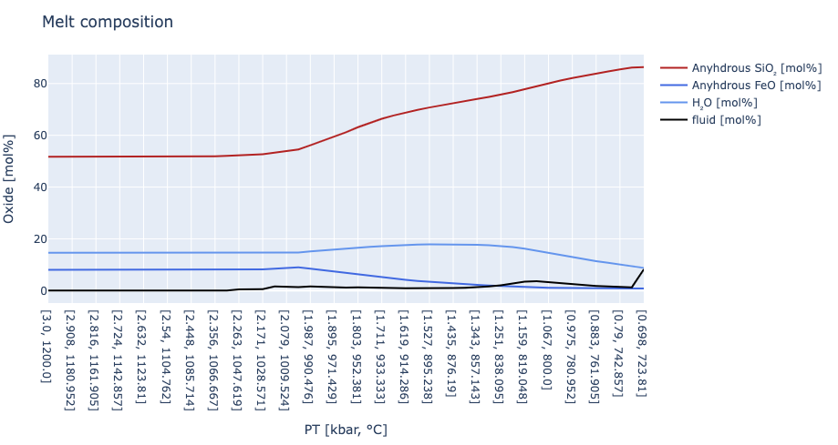
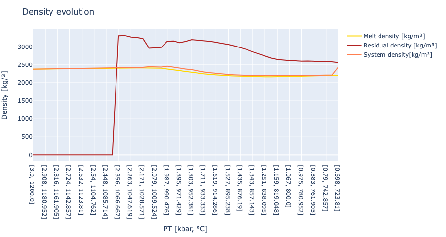

# MAGEMin_C.jl: Examples

This page provides a set of examples showing how to use MAGEMin_C.jl to perform phase equilibrium calculations.

!!! note
    - Examples 1 to 7 are simple exercises to make you familiar with the various options available for the calculation
    - Example 8 is a step-by-step tutorial showing how to build up complexity using `MAGEMin_C.jl`
    - Examples 9 to 11 are more advanced and some basic background in `Julia` programming are recommanded

## Quickstart examples

### E.1 - Predefined compositions
This is an example of how to use it for a predefined bulk rock composition:
```julia
using MAGEMin_C
db   = "ig"  # database: ig, igneous (Holland et al., 2018); mp, metapelite (White et al 2014b)
data = Initialize_MAGEMin(db, verbose=true);
test = 0         #KLB1
data = use_predefined_bulk_rock(data, test);
P    = 8.0;
T    = 800.0;
out  = point_wise_minimization(P,T, data);
```
which gives
``` julia
 Status             :            0 
 Mass residual      : +5.34576e-06
 Rank               :            0 
 Point              :            1 
 Temperature        :   +800.00000       [C] 
 Pressure           :     +8.00000       [kbar]

 SOL = [G: -797.749] (25 iterations, 39.62 ms)
 GAM = [-979.481432,-1774.104523,-795.261024,-673.747244,-375.070247,-917.557241,-829.990582,-1023.656703,-257.019268,-1308.294427]

 Phase :      spn      cpx      opx       ol 
 Mode  :  0.02799  0.14166  0.24228  0.58807 
```

!!! note
    Thermodynamic dataset acronym are the following:
    - `mtl` -> mantle (Holland et al., 2013)
    - `mp` -> metapelite (White et al., 2014)
    - `mb` -> metabasite (Green et al., 2016)
    - `ig` -> igneous (Green et al., 2025 updated from and replacing Holland et al., 2018)
    - `igad` -> igneous alkaline dry (Weller et al., 2024)
    - `um` -> ultramafic (Evans & Frost, 2021)
    - `sb11` -> Stixrude & Lithgow-Bertelloni (2011)
    - `sb21` -> Stixrude & Lithgow-Bertelloni (2021)
    - `ume` -> ultramafic extended (Green et al., 2016 + Evans & Frost, 2021)
    - `mpe` -> extended metapelite (White et al., 2014 + Green et al., 2016 + Franzolin et al., 2011 + Diener et al., 2007)
    - `mbe` -> extended metabasite (Green et al., 2016 + Diener et al., 2007 + Rebay et al., 2022)


### E.2 - Custom composition
And here a case in which you specify your own bulk rock composition.
```julia
using MAGEMin_C
data    = Initialize_MAGEMin("ig", verbose=false);
P,T     = 10.0, 1100.0
Xoxides = ["SiO2"; "Al2O3"; "CaO"; "MgO"; "FeO"; "Fe2O3"; "K2O"; "Na2O"; "TiO2"; "Cr2O3"; "H2O"];
X       = [48.43; 15.19; 11.57; 10.13; 6.65; 1.64; 0.59; 1.87; 0.68; 0.0; 3.0];
sys_in  = "wt"
out     = single_point_minimization(P, T, data, X=X, Xoxides=Xoxides, sys_in=sys_in)
```
which gives:
``` julia
Pressure          : 10.0      [kbar]
Temperature       : 1100.0    [Celsius]
     Stable phase | Fraction (mol fraction) 
              liq   0.75133 
              cpx   0.20987 
              opx   0.03877 
     Stable phase | Fraction (wt fraction) 
              liq   0.73001 
              cpx   0.22895 
              opx   0.04096 
Gibbs free energy : -916.874646  (45 iterations; 86.53 ms)
Oxygen fugacity          : 2.0509883251350577e-8
```

After the calculation is finished, the structure `out` holds all the information about the stable assemblage, including seismic velocities, melt content, melt chemistry, densities etc.
You can show a full overview of that with
```julia
print_info(out)
```
If you are interested in the density or seismic velocity at the point, access it with
```julia
out.rho
2755.2995530913095
out.Vp
3.945646731595539
```
Once you are done with all calculations, release the memory with
```julia
Finalize_MAGEMin(data)
```

### E.3 - Export data to CSV
Using previous example to compute a point:
```julia
using MAGEMin_C
dtb     = "ig"
data    = Initialize_MAGEMin(dtb, verbose=false);
P,T     = 10.0, 1100.0
Xoxides = ["SiO2"; "Al2O3"; "CaO"; "MgO"; "FeO"; "Fe2O3"; "K2O"; "Na2O"; "TiO2"; "Cr2O3"; "H2O"];
X       = [48.43; 15.19; 11.57; 10.13; 6.65; 1.64; 0.59; 1.87; 0.68; 0.0; 3.0];
sys_in  = "wt"
out     = single_point_minimization(P, T, data, X=X, Xoxides=Xoxides, sys_in=sys_in)
```
Exporting the result of the minimization(s) to an CSV file is straightforward:
```julia
MAGEMin_data2dataframe(out,dtb,"filename")
```
where `out` is the output structure, `dtb` is the database acronym and `"filename"` is the filename :)

!!! note
    * You don't have to add the file extension `.csv`
    * The output path (MAGEMin_C directory) is displayed in the Julia terminal
    * For multiple points, simply provide the `Julia` ```Vector{out}```. See Example 8 for more details on how to create a vector of minimization output.

### E.4 - Removing solution phase(s) from consideration
To suppress solution phases from the calculation, define a remove list `rm_list` using the `remove_phases()` function. In the latter, provide a vector of the solution phase(s) you want to remove and the database acronym as a second argument. Then pass the created `rm_list` to the `single_point_minimization()` function.
```julia
using MAGEMin_C
data    = Initialize_MAGEMin("mp", verbose=-1, solver=0);
rm_list = remove_phases(["liq","sp"],"mp");
P,T     = 10.713125, 1177.34375;
Xoxides = ["SiO2","Al2O3","CaO","MgO","FeO","K2O","Na2O","TiO2","O","MnO","H2O"];
X       = [70.999,12.805,0.771,3.978,6.342,2.7895,1.481,0.758,0.72933,0.075,30.0];
sys_in  = "mol";
out     = single_point_minimization(P, T, data, X=X, Xoxides=Xoxides, sys_in=sys_in,rm_list=rm_list)
```
which gives:
``` julia
Pressure          : 10.713125      [kbar]
Temperature       : 1177.3438    [Celsius]
     Stable phase | Fraction (mol fraction) 
              fsp   0.29236 
                g   0.13786 
             ilmm   0.01526 
                q   0.22534 
             sill   0.10705 
              H2O   0.22213 
     Stable phase | Fraction (wt fraction) 
              fsp   0.34544 
                g   0.17761 
             ilmm   0.0261 
                q   0.25385 
             sill   0.12197 
              H2O   0.07503 
     Stable phase | Fraction (vol fraction) 
              fsp   0.31975 
                g   0.10873 
             ilmm   0.01307 
                q   0.23367 
             sill   0.08991 
              H2O   0.23487 
Gibbs free energy : -920.021202  (25 iterations; 27.45 ms)
Oxygen fugacity          : -5.4221261006295105
Delta QFM                : 2.506745293747623
```

!!! note
    Note that if you want to suppress a single phase, you still need to define a vector to be passed to the `remove_phases()` function, such as shown below.

```julia
using MAGEMin_C
data    = Initialize_MAGEMin("mp", verbose=-1, solver=0);
rm_list = remove_phases(["liq"],"mp");
P,T     = 10.713125, 1177.34375;
Xoxides = ["SiO2","Al2O3","CaO","MgO","FeO","K2O","Na2O","TiO2","O","MnO","H2O"];
X       = [70.999,12.805,0.771,3.978,6.342,2.7895,1.481,0.758,0.72933,0.075,30.0];
sys_in  = "mol";
out     = single_point_minimization(P, T, data, X=X, Xoxides=Xoxides, sys_in=sys_in,rm_list=rm_list)
```
which gives:
```julia
Pressure          : 10.713125      [kbar]
Temperature       : 1177.3438    [Celsius]
     Stable phase | Fraction (mol fraction) 
              fsp   0.29337 
                g   0.12 
               sp   0.03036 
                q   0.23953 
             sill   0.08939 
               ru   0.00521 
              H2O   0.22213 
     Stable phase | Fraction (wt fraction) 
              fsp   0.34667 
                g   0.15368 
               sp   0.04514 
                q   0.26983 
             sill   0.10184 
               ru   0.00781 
              H2O   0.07503 
     Stable phase | Fraction (vol fraction) 
              fsp   0.31981 
                g   0.09422 
               sp   0.02492 
                q   0.24761 
             sill   0.07484 
               ru   0.00446 
              H2O   0.23413 
Gibbs free energy : -920.00146  (19 iterations; 27.79 ms)
Oxygen fugacity          : -5.760704474307317
Delta QFM                : 2.1681669200698166
```

### E.5 - Oxygen buffer

Here we need to initialize MAGEMin with the desired buffer (qfm in this case, see list at the beginning). 

!!! note
    Note that O/Fe2O3 value needs to be large enough to saturate the system. Excess oxygen-content will be removed from the output

```julia
using MAGEMin_C 
data    = Initialize_MAGEMin("ig", verbose=false, buffer="qfm");
P,T     = 10.0, 1100.0
Xoxides = ["SiO2","Al2O3","CaO","MgO","FeO","K2O","Na2O","TiO2","O","Cr2O3","H2O"];
X       = [48.43; 15.19; 11.57; 10.13; 6.65; 1.64; 0.59; 1.87; 4.0; 0.1; 3.0];
sys_in  = "wt"    
out     = single_point_minimization(P, T, data, X=X, Xoxides=Xoxides, sys_in=sys_in)
```

Buffer offset in the log10 scale can be applied as

```julia
using MAGEMin_C 
data    = Initialize_MAGEMin("ig", verbose=false, buffer="qfm");
P,T     = 10.0, 1100.0
Xoxides = ["SiO2","Al2O3","CaO","MgO","FeO","K2O","Na2O","TiO2","O","Cr2O3","H2O"];
X       = [48.43; 15.19; 11.57; 10.13; 6.65; 1.64; 0.59; 1.87; 4.0; 0.1; 3.0];
offset  = -1.0
sys_in  = "wt"    
out     = single_point_minimization(P, T, data, X=X, Xoxides=Xoxides, B=offset, sys_in=sys_in)
```

!!! note
    Several buffers can be used to fix the oxygen fugacity
    - `qfm` -> quartz-fayalite-magnetite
    - `qif` -> quartz-iron-fayalite
    - `nno` -> nickel-nickel oxide
    - `hm` -> hematite-magnetite
    - `iw` -> iron-wüstite
    - `cco` -> carbon dioxide-carbon


### E.6 - Activity buffer

Like for oxygen buffer, activity buffer can be prescribe as follow

!!! note
    Note that the corresponding oxide-content needs to be large enough to saturate the system. Excess oxide-content will be removed from the output

```julia
using MAGEMin_C 
data    = Initialize_MAGEMin("ig", verbose=false, buffer="aTiO2");
P,T     = 10.0, 700.0
Xoxides = ["SiO2","Al2O3","CaO","MgO","FeO","K2O","Na2O","TiO2","O","Cr2O3","H2O"];
X       = [48.43; 15.19; 11.57; 10.13; 6.65; 1.64; 0.59; 4.0; 0.1; 0.1; 3.0];
value  = 0.9
sys_in  = "wt"    
out     = single_point_minimization(P, T, data, X=X, Xoxides=Xoxides, B=value, sys_in=sys_in)
```

!!! note
    Similarly activity can be fixed for the following oxides
    - `aH2O` -> using water as reference phase
    - `aO2`   -> using dioxygen as reference phase
    - `aMgO` -> using periclase as reference phase
    - `aFeO` -> using ferropericlase as reference phase
    - `aAl2O3` -> using corundum as reference phase
    - `aTiO2` -> using rutile as reference phase
    - `aSiO2` -> using quartz/coesite as reference phase


### E.7 - Many points

```julia
using MAGEMin_C
db   = "ig"  # database: ig, igneous (Holland et al., 2018); mp, metapelite (White et al 2014b)
data  = Initialize_MAGEMin(db, verbose=false);
test = 0         #KLB1
n    = 1000
P    = rand(8.0:40,n);
T    = rand(800.0:2000.0, n);
out  = multi_point_minimization(P,T, data, test=test);
Finalize_MAGEMin(data)
```
By default, this will show a progressbar (which you can deactivate with the `progressbar=false` option).

You can also specify a custom bulk rock for all points (see above), or a custom bulk rock for every point.

## Step-by-step

### E.8 - Loop phase equilibrium calculation

first add MAGEMin_C and Plots
```julia
julia> ] add MAGEMin_C
julia> ] add Plots
```

and use MAGEMin_C and Plots as:

```julia
using MAGEMin_C, Plots
```

First let's first initialize MAGEMin with the metapelite database (White et al ., 2014)

```julia
data        =   Initialize_MAGEMin("mp", verbose=true);
```

Then define the bulk-rock composition (wt fraction) the related oxide list and the system unit

```julia
X           = [0.5922, 0.1813, 0.006, 0.0223, 0.0633, 0.0365, 0.0127, 0.0084, 0.0016, 0.0007, 0.075]
Xoxides     = ["SiO2", "Al2O3", "CaO", "MgO", "FeO", "K2O", "Na2O", "TiO2", "O", "MnO", "H2O"]
sys_unit    = "wt"
```

!!! note
    Here we use the water-oversaturated FWorld Average composition for metapelite

Define test pressure and temperature condition for test point:
```julia
P = 10.0
T = 700.0
```

and perform the test calculation:

```julia
out  = single_point_minimization(P, T, data, X=X, Xoxides=Xoxides, sys_in=sys_unit, name_solvus = true)
```

which should gives:

```
Pressure          : 10.0      [kbar]
Temperature       : 700.0    [Celsius]
     Stable phase | Fraction (mol fraction) 
                g   0.07753 
               mu   0.169 
              liq   0.24053 
               bi   0.09972 
              ilm   0.01863 
                q   0.24848 
               ky   0.04752 
               ru   0.00037 
              H2O   0.09821 
     Stable phase | Fraction (wt fraction) 
                g   0.09343 
               mu   0.19964 
              liq   0.20529 
               bi   0.10706 
              ilm   0.02116 
                q   0.27091 
               ky   0.06987 
               ru   0.00054 
              H2O   0.03211 
     Stable phase | Fraction (vol fraction) 
                g   0.0595 
               mu   0.18 
              liq   0.25537 
               bi   0.09142 
              ilm   0.01096 
                q   0.26397 
               ky   0.04914 
               ru   0.00033 
              H2O   0.0893 
Gibbs free energy : -853.149024  (27 iterations; 12.19 ms)
Oxygen fugacity          : -13.51247569580698
Delta QFM                : 2.4956538482297375
```

Instead, of using a single pressure and temperature conditions let's now keep the pressure fixed and vary the temperature

```julia
n = 50
P = 10.0
T = collect(range(400.0,800.0,n))
```

Here ```range(min,max,n)``` will create a range of value between min and max with n steps. ```collect()``` turns the range into an array that can be indexed.


Create a loop from 1 to n in order to compute a stable phase equilibrium for all the entries of the ```T``` array. This can be done as follow:

```julia
for i=1:n
    T_calc = T[i]       # retrieves the temperature from the temperature array we just defined  
    out  = single_point_minimization(P, T_calc, data, X=X, Xoxides=Xoxides, sys_in=sys_unit)
end
```

Although this performs the set of 50 phase equilibrium calculations as intended, the script is not yet very useful as the results of the calculation are not stored.

To store the results of the stable phase equilibrium calculations you can declare an array of MAGEMin_C output structure such as:

```julia
out = Vector{MAGEMin_C.gmin_struct{Float64, Int64}}(undef,n)
for i=1:n
    T_calc  = T[i]       # retrieves the temperature from the temperature array we just defined  
    out[i]  = single_point_minimization(P, T_calc, data, X=X, Xoxides=Xoxides, sys_in=sys_unit, name_solvus = true)
end
```

!!! note
    The first line of previous snippet create a Vector of MAGEMin_C structures, of size ```n```and with undefined content. In this case we are interested in 1D array, but in a similar manner you could create a Matrix e.g., ```out = Matrix{MAGEMin_C.gmin_struct{Float64, Int64}}(undef,n,n)```

Once the calculation are peformed you can access all the informations:

```
out[2].    #then hit double `tabulation` key twice
```

The latter will display all the entries of point ```2```. If you want to retrieve the melt volume fraction you can do so by accessing ```out[2].frac_M_vol```. In the case of point 2, we get:

```
julia> out[2].frac_M_vol
0.0
```

Now the question is how to gather in a efficient `juliaesk`manner the volume fractions for all computed points? One relatively quick and efficient way is as follow:

```julia
frac_M_vol = [out[i].frac_M_vol for i=1:n]
```

which should yield in the terminal:
```
julia> frac_M_vol = [out[i].frac_M_vol for i=1:n]
50-element Vector{Float64}:
 0.0
 0.0
 0.0
 0.0
 0.0
 ⋮
 0.66483750887145
 0.6823915840521158
 0.7005692654225463
 0.7193913179922915
 0.7388665024379735
```


To retrieve the vol fraction of a solid phase, the process is slightly more complex as we have to check in the phase is present in the mineral assemblage first. Let's first allocate an array for the volume fraction of quartz (`q`):

```julia
q_vol = zeros(Float64,n)
```

Let us now loop through the output structure to look for quartz in the stable mineral assemblage, and in the event quartz is stable, retrieve its volume fraction:

```julia
for i=1:n
    if "q" in out[i].ph     #here we check if out[i].ph contains "q"
        id_q = findfirst(out[i].ph .== "q")
        q_vol[i] = out[i].ph_frac_vol[id_q]
    end
end
```

!!! note
    We first here check if "q" is in the phase assemblage. Then the command `id_q = findfirst(out[i].ph .== "q")`find the position of "quartz" in the array to be able to retrieve to right value.

Using `plots.jl`, plot the volume fraction of melt and quartz as function of the temperature. Note that you can save the figure by using:

```julia
plot(   T,  q_vol .* 100, 
        label = "qtz",
        xlabel = "T°C",
        ylabel = "vol%")
```

!!! note
    You can save the figure using;

    ```julia
    plot!(size=(400,400))
    savefig("figure.png")
    ```
    The first line update the resolution of the plot according to your needs, while the second line effectively save the figure. Note that you can use different output format (`png`,`jpg`,`pdf`)

One way to make the model more realistic is by dynamically adjusting the composition at every step by removing excess water from it. This can be be done by modifying your calculation as follow:

```julia
if "H2O" in out[i].ph
    id_h2o      = findfirst(out[i].ph .== "H2O")
    h2o_wt      = out[i].ph_frac_wt[id_h2o]
    h2o_comp_wt = out[i].PP_vec[id_h2o - out[i].n_SS].Comp_wt

    X           = X .- (h2o_wt .* h2o_comp_wt)
end
```

Here, we first look for the id of "H2O" pure phase. Then, we get the water fraction in `wt`. Subsequently, we retrieve the composition of "H2O".  This part is slightly more complex as the information of solution models (`SS_vec`) are stored in a different substructure with respect to pure phases (`PP_vec`). In order to find the right id for "H2O" in the the `PP_vec`substructure we do `id_h2o - out[i].n_SS` where `out[i].n_SS` is the total number of solution models in the stable assemblage.

!!! note
    - The previous code snipped has to be placed after calling `single_point_minimization()`
    - Mind that for the igneous database, there is a fluid model "fl" instead of pure water ("H2O").


## Advanced examples

### E.9 - Fractional crystallization

The following example shows how to perform fractional crystallization using a hydrous basalt magma as a starting composition. The results are displayed using PlotlyJS. This example is provided in the hope it may be useful for learning how to use MAGEMin_C for more advanced applications. 

!!! note
    Note that if we wanted to use a buffer, we would need to initialize MAGEMin as in example 4. Because during fractional crystallization the bulk-rock composition is updated at every step, we would need to increase the oxygen-content (`O`) of the new bulk-rock

```julia
using MAGEMin_C
using PlotlyJS

# number of computational steps
nsteps = 64

# Starting/ending Temperature [°C]
T = range(1200.0,600.0,nsteps)

# Starting/ending Pressure [kbar]
P = range(3.0,0.1,nsteps)

# Starting composition [mol fraction], here we used an hydrous basalt; composition taken from Blatter et al., 2013 (01SB-872, Table 1), with added O and water saturated
oxides  = ["SiO2"; "Al2O3"; "CaO"; "MgO"; "FeO"; "K2O"; "Na2O"; "TiO2"; "O"; "Cr2O3"; "H2O"]
bulk_0  = [38.448328757254195, 7.718376151972274, 8.254653357127351, 9.95911842561036, 5.97899305676308, 0.24079752710315697, 2.2556006776515964, 0.7244006013202644, 0.7233140004182841, 0.0, 12.696417444779453];

# Define bulk-rock composition unit
sys_in  = "mol"

# Choose database
data    = Initialize_MAGEMin("ig", verbose=false);

# allocate storage space
Out_XY  = Vector{MAGEMin_C.gmin_struct{Float64, Int64}}(undef,nsteps)

melt_F  = 1.0
bulk    = copy(bulk_0)
np      = 0
while melt_F > 0.0
    np             +=1

    out     = single_point_minimization(P[np], T[np], data, X=bulk, Xoxides=oxides, sys_in=sys_in) 
    Out_XY[np]   = deepcopy(out)

    # retrieve melt composition to use as starting composition for next iteration
    melt_F          = out.frac_M
    bulk           .= out.bulk_M 

    print("#$np  P: $(round(P[np],digits=3)), T: $(round(T[np],digits=3))\n")
    print("    ---------------------\n")
    print("     melt_F: $(round(melt_F, digits=3))\n     melt_composition: $(round.(bulk ,digits=3))\n\n")

end

ndata               = np -1             # last point has melt fraction = 0

x                   = Vector{String}(undef,ndata)
melt_SiO2_anhydrous = Vector{Float64}(undef,ndata)
melt_FeO_anhydrous  = Vector{Float64}(undef,ndata)
melt_H2O            = Vector{Float64}(undef,ndata)
fluid_frac          = Vector{Float64}(undef,ndata)
melt_density        = Vector{Float64}(undef,ndata)
residual_density    = Vector{Float64}(undef,ndata)
system_density      = Vector{Float64}(undef,ndata)

for i=1:ndata
    x[i]    = "[$(round(P[i],digits=3)), $(round(T[i],digits=3))]"
    melt_SiO2_anhydrous[i]  = Out_XY[i].bulk_M[1] / (sum(Out_XY[i].bulk_M[1:end-1])) * 100.0
    melt_FeO_anhydrous[i]   = Out_XY[i].bulk_M[5] / (sum(Out_XY[i].bulk_M[1:end-1])) * 100.0
    melt_H2O[i]             = Out_XY[i].bulk_M[end] *100
    fluid_frac[i]           = Out_XY[i].frac_F*100

    melt_density[i]         = Out_XY[i].rho_M
    residual_density[i]     = Out_XY[i].rho_S 
    system_density[i]       = Out_XY[i].rho
end

# section to plot composition evolution
trace1 = scatter(   x       = x, 
                    y       = melt_SiO2_anhydrous, 
                    name    = "Anyhdrous SiO₂ [mol%]",
                    line    = attr( color   = "firebrick", 
                                    width   = 2)                )
trace2 = scatter(   x       = x, 
                    y       = melt_FeO_anhydrous, 
                    name    = "Anyhdrous FeO [mol%]",
                    line    = attr( color   = "royalblue", 
                                    width   = 2)                )

trace3 = scatter(   x       = x, 
                    y       = melt_H2O, 
                    name    = "H₂O [mol%]",
                    line    = attr( color   = "cornflowerblue", 
                                    width   = 2)                )

trace4 = scatter(   x       = x, 
                    y       = fluid_frac, 
                    name    = "fluid [mol%]",
                    line    = attr( color   = "black", 
                                    width   = 2)                )

layout = Layout(    title           = "Melt composition",
                    xaxis_title     = "PT [kbar, °C]",
                    yaxis_title     = "Oxide [mol%]")


plot([trace1,trace2,trace3,trace4], layout)
```

```@raw html

```

```julia

# section to plot density evolution
trace1 = scatter(   x       = x, 
                    y       = melt_density, 
                    name    = "Melt density [kg/m³]",
                    line    = attr( color   = "gold", 
                                    width   = 2)                )
                      
trace2 = scatter(   x       = x, 
                    y       = residual_density, 
                    name    = "Residual density [kg/m³]",
                    line    = attr( color   = "firebrick", 
                                    width   = 2)                )
                      
trace3 = scatter(   x       = x, 
                    y       = system_density, 
                    name    = "System density[kg/m³]",
                    line    = attr( color   = "coral", 
                                    width   = 2)                )

layout = Layout(    title           = "Density evolution",
                    xaxis_title     = "PT [kbar, °C]",
                    yaxis_title     = "Density [kg/³]")


plot([trace1,trace2,trace3], layout)
```

```@raw html

```

### E.10 - Threaded (parallel) fractional crystallization

```julia

using ProgressMeter
using MAGEMin_C
using Base.Threads: @threads

function get_data_thread( MAGEMin_db :: MAGEMin_Data )

    id          = Threads.threadid()
    gv          = MAGEMin_db.gv[id]
    z_b         = MAGEMin_db.z_b[id]
    DB          = MAGEMin_db.DB[id]
    splx_data   = MAGEMin_db.splx_data[id]
    
   return (gv, z_b, DB, splx_data)
end

function example_of_threaded_MAGEMin_calc(  data_thread :: Tuple{Any, Any, Any, Any}, dtb :: String,

                                            starting_P :: Float64,
                                            starting_T :: Float64,
                                            ending_T   :: Float64,
                                            n_steps    :: Int64,

                                            sys_in     :: String,
                                            bulk       :: Vector{Float64},
                                            Xoxides    :: Vector{String}           )

    gv, z_b, DB, splx_data = data_thread        # Unpack the MAGEMin data

    Out_PT = Vector{MAGEMin_C.gmin_struct{Float64, Int64}}(undef, n_steps)
    gv      = define_bulk_rock(gv, bulk, Xoxides, sys_in, dtb);

    for i = 1:n_steps


        P       = Float64(starting_P)
        T       = Float64(starting_T - (starting_T - ending_T) * (i-1)/(n_steps-1))

        out     = point_wise_minimization(  P, T, gv, z_b, DB, splx_data;
                                                name_solvus=true)

        Out_PT[i] = deepcopy(out)

        if "liq" in out.ph 
            bulk    = out.bulk_M
            oxides  = out.oxides

            gv      = define_bulk_rock(gv, bulk, oxides, "mol", dtb);
        end

    end

    return Out_PT

end

function perform_threaded_calc( Out_all     :: Vector{Vector{MAGEMin_C.gmin_struct{Float64, Int64}}},
                                data        :: MAGEMin_Data,
                                dtb         :: String,
                                n_starting_points :: Int64,
                                starting_P  :: Vector{Float64},
                                starting_T  :: Vector{Float64},
                                ending_T    :: Vector{Float64},
                                n_steps     :: Int64,
                                sys_in      :: String,
                                bulk        :: Matrix{Float64},
                                Xoxides     :: Vector{String} )

    progr = Progress(n_starting_points, desc="Computing $n_starting_points examples of threaded MAGEMin_calc...") # progress meter
    @threads :static for i=1:n_starting_points

        data_thread = get_data_thread(data)
        starting_P_  = starting_P[i]
        starting_T_  = starting_T[i]
        ending_T_    = ending_T[i]
        n_steps_     = n_steps
        bulk_        = bulk[i,:]

        Out_PT = example_of_threaded_MAGEMin_calc(  data_thread, dtb,

                                                    starting_P_,
                                                    starting_T_,
                                                    ending_T_,
                                                    n_steps_,
                                                    sys_in,
                                                    bulk_,
                                                    Xoxides )

        Out_all[i] = Out_PT
        next!(progr)

    end
    finish!(progr)

    return Out_all
end

# first initialize MAGEMin
dtb     = "mp"
data    = Initialize_MAGEMin(dtb, verbose=-1; solver=2);

n_starting_points  = 64

# Allocate memory for the output (Nested_structure where each element is a vector of gmin_struct)
Out_all  =  Vector{Vector{MAGEMin_C.gmin_struct{Float64, Int64}}}(undef, n_starting_points);


starting_P  = [range(1.0,10.0,n_starting_points);]      # 10 starting points
starting_T  = ones(n_starting_points) .* 1300.0      
ending_T    = ones(n_starting_points) .* 600.0  
n_steps     = 128

sys_in      = "wt"
bulk        = repeat([58.509,  1.022,   14.858, 4.371, 0.141, 4.561, 5.912, 3.296, 2.399, 10.0, 0.0]', n_starting_points)
Xoxides     = ["SiO2", "TiO2", "Al2O3", "FeO",  "MnO",  "MgO",  "CaO",  "Na2O", "K2O","H2O","O"]

Out_all     = perform_threaded_calc(Out_all, data, dtb, n_starting_points, starting_P, starting_T, ending_T, n_steps, sys_in, bulk, Xoxides);

Finalize_MAGEMin(data)

```

### E.11 - Isentropic path calculation

```julia
using MAGEMin_C
using Plots
using ProgressMeter

dtb         = "ig"
data        = Initialize_MAGEMin(dtb,verbose=-1);
test        = 0         # KLB-1
data        = use_predefined_bulk_rock(data, test);

MPT         = 1350.0;                                                            # Mantle potential temperature in °C
adiabat     = 0.55;                                                              # Adiabatic gradient in the upper mantle °C/km
Depth       = 100.0;                                                             # Depth in km
rho_Mantle  = 3300.0;                                                            # Density of the mantle in kg/m³

Ts          = MPT + adiabat * Depth                                              # Starting temperature in the isentropic path (rough estimate)
Ps          = Depth*1e3*9.81*rho_Mantle/1e5/1e3                                  # Starting pressure in kbar (rough estimate)
Pe          = 0.001;                                                             # Ending pressure in kbar

n_steps     = 32;                                                                # number of steps in the isentropic path
n_max       = 32;                                                                # Maximum number of iterations in the bisection method
tolerance   = 0.1;                                                               # Tolerance for the bisection method
P           = Array(range(Ps, stop=Pe, length=n_steps))                          # Defines pressure values for the isentropic path
out         = Vector{MAGEMin_C.gmin_struct{Float64, Int64}}(undef, n_steps)      # Vector to store the output of the single_point_minimization function
out_tmp     = MAGEMin_C.gmin_struct{Float64, Int64};

# compute the reference entropy at pressure and temperature of reference 
out[1]      = deepcopy( single_point_minimization(Ps,Ts, data));
Sref        = out[1].entropy                                                    # Entropy of the system at the starting point   

@showprogress for j = 2:n_steps

        a           = out[j-1].T_C - 50.0
        b           = out[j-1].T_C
        n           = 1
        conv        = 0
        n           = 0
        sign_a      = -1

        while n < n_max && conv == 0
            c       = (a+b)/2.0
            out_tmp = deepcopy( single_point_minimization(P[j],c, data));
            result  = out_tmp.entropy - Sref

            sign_c  = sign(result)

            if abs(b-a) < tolerance
                conv = 1
            else
                if  sign_c == sign_a
                    a = c
                    sign_a = sign_c
                else
                    b = c
                end
                
            end
            n += 1
        end

        out[j] = deepcopy(out_tmp)
end

Finalize_MAGEMin(data)


#=
    In the following section we extract the melt fraction, total melt fraction, SiO2 in the melt, melt density for all steps
=#
S           = [out[i].entropy for i in 1:n_steps];                          # check entropy values
frac_M      = [out[i].frac_M for i in 1:n_steps];                           # Melt fraction for all steps
frac_M[frac_M .== 0.0] .= NaN;                                              # Replace 0.0 values with NaN
T           = [out[i].T_C for i in 1:n_steps];                              # extract temperature for all steps

SiO2_id     = findfirst(out[1].oxides .== "SiO2")                           # Index of SiO2 in the oxides array   
dry_id      = findall(out[1].oxides .!= "H2O")                              # Indices of all oxides except H2O
SiO2_M_dry  = [ (out[i].bulk_M[SiO2_id] / sum(out[i].bulk_M[dry_id])*100.0) for i in 1:n_steps];                             # SiO2 in the melt for all steps
rho_M       = [ (out[i].rho_M) for i in 1:n_steps];                         # melt density for all steps
rho_M[rho_M .== 0.0] .= NaN;                                                # Replace 0.0 values with NaN


#=
    Ploting the results using Plots
=#
p1          = plot(T,P, xlabel="Temperature (°C)", marker = :circle, markersize = 2, lw=2, ylabel="Pressure (kbar)", legend=false)
p2          = plot(frac_M,P, xlabel="Melt fraction (mol)", marker = :circle, markersize = 2, lw=2, ylabel="Pressure (kbar)", legend=false)
p3          = plot(rho_M,P, xlabel="Melt density (kg/m³)", marker = :circle, markersize = 2, lw=2, ylabel="Pressure (kbar)",        legend=false)
p4          = plot(SiO2_M_dry,P, xlabel="SiO₂ melt anhydrous (mol%)", marker = :circle, markersize = 2, lw=2, ylabel="Pressure (kbar)",  legend=false)


fig = plot(p1, p2, p3, p4, layout=(2, 2), size=(800, 600))
savefig(fig,"isentropic_path.png")
```


## Access complete information about the minimization

in the previous examples the results of the minimization are saved in a structure called `out`. To access all the information stored in the structure simply do:

```julia
out.
```

Then press `tab` (tabulation key) to display all stored data:

```julia

out.
G_system Gamma MAGEMin_ver M_sys PP_vec P_kbar SS_vec T_C V Vp Vp_S Vs Vs_S X
aAl2O3 aFeO aH2O aMgO aSiO2 aTiO2 alpha bulk bulkMod bulkModulus_M bulkModulus_S bulk_F bulk_F_wt bulk_M
bulk_M_wt bulk_S bulk_S_wt bulk_res_norm bulk_wt cp dQFM dataset enthalpy entropy fO2 frac_F frac_F_wt frac_M
frac_M_wt frac_S frac_S_wt iter mSS_vec n_PP n_SS n_mSS oxides ph ph_frac ph_frac_vol ph_frac_wt ph_id
ph_type rho rho_F rho_M rho_S s_cp shearMod shearModulus_S status time_ms
```

In order to access any of these variables type for instance:

```julia
out.fO2
```

which will give you the oxygen fugacity:

```julia
out.fO2
-4.405735414252153
```

to access the list of stable phases and their fraction in `mol`:

```julia
out.ph
4-element Vector{String}:
"liq"
"g"
"sp"
"ru"

out.ph_frac
4-element Vector{Float64}:
0.970482189810529
0.003792750364729876
0.020229088594267013
0.0054959712304740085
```

Chemical potential of the pure components (oxides) of the system is retrieved as:

```julia
out.Gamma
11-element Vector{Float64}:
-1017.3138187719679
-1847.7215909497188
-881.3605772634041
-720.5475835413267
-428.1896629304572
-1051.6248892195592
-1008.7336303031074
-1070.7332593397723
-228.07833391903714
-561.1937065530427
-440.764181608507

out.oxides
11-element Vector{String}:
"SiO2"
"Al2O3"
"CaO"
"MgO"
"FeO"
"K2O"
"Na2O"
"TiO2"
"O"
"MnO"
"H2O"
```

The composition in `wt` of the first listed solution phase ("liq") can be accessed as

```julia
out.SS_vec[1].Comp_wt
11-element Vector{Float64}:
0.6174962747665693
0.1822124172602761
0.006265730986600257
0.0185105629478801
0.04555393290694774
0.038161590650707795
0.013329583423813463
0.0
0.0
0.0
0.07846990705720527
```

and the end-member fraction in `wt` and their names as

```julia
out.SS_vec[1].emFrac_wt
8-element Vector{Float64}:
0.4608062343057727
0.0972375952287159
0.17818888101139307
0.02313962538195582
0.12734359573100587
0.025819902698522926
0.047571646835750894
0.03989251880688298
out.SS_vec[1].emNames
8-element Vector{String}:
"q4L"
"abL"
"kspL"
"anL"
"slL"
"fo2L"
"fa2L"
"h2oL"
```

## Running MAGEMin_C it in parallel

Julia can be run in parallel using multi-threading. To take advantage of this, you need to start julia from the terminal with:

```bash
julia -t auto
```
which will automatically use all threads on your machine. Alternatively, use `julia -t 4` to start it on 4 threads.
If you are interested to see what you can do on your machine, type:

```julia
versioninfo()
Julia Version 1.9.0
Commit 8e630552924 (2023-05-07 11:25 UTC)
Platform Info:
OS: macOS (arm64-apple-darwin22.4.0)
CPU: 12 × Apple M2 Max
WORD_SIZE: 64
LIBM: libopenlibm
LLVM: libLLVM-14.0.6 (ORCJIT, apple-m1)
Threads: 8 on 8 virtual cores
```

The function `multi_point_minimization` will automatically utilize parallelization if you run it on >1 threads.


## References

- Green, ECR, Holland, TJB, Powell, R, Weller, OM, & Riel, N (2025). Journal of Petrology, 66, doi: 10.1093/petrology/egae079

- Weller, OM, Holland, TJB, Soderman, CR, Green, ECR, Powell, R, Beard, CD & Riel, N (2024). New Thermodynamic Models for Anhydrous Alkaline-Silicate Magmatic Systems. Journal of Petrology, 65, doi: 10.1093/petrology/egae098

- Holland, TJB, Green, ECR & Powell, R (2022). A thermodynamic modelfor feldspars in KAlSi3O8-NaAlSi3O8-CaAl2Si2O8 for mineral equilibrium calculations. Journal of Metamorphic Geology, 40, 587-600, doi: 10.1111/jmg.12639

- Tomlinson, EL & Holland, TJB (2021). A Thermodynamic Model for the Subsolidus Evolution and Melting of Peridotite. Journal of Petrology,62, doi: 10.1093/petrology/egab012

- Holland, TJB, Green, ECR & Powell, R (2018). Melting of Peridotitesthrough to Granites: A Simple Thermodynamic Model in the System KNCFMASHTOCr. Journal of Petrology, 59, 881-900, doi: 10.1093/petrology/egy048

- Green, ECR, White, RW, Diener, JFA, Powell, R, Holland, TJB & Palin, RM (2016). Activity-composition relations for the calculationof partial melting equilibria in metabasic rocks. Journal of Metamorphic Geology, 34, 845-869, doi: 10.1111/jmg12211

- White, RW, Powell, R, Holland, TJB, Johnson, TE & Green, ECR (2014). New mineral activity-composition relations for thermodynamic calculations in metapelitic systems. Journal of Metamorphic Geology, 32, 261-286, doi: 10.1111/jmg.12071

- Holland, TJB & Powell, RW (2011). An improved and extended internally consistent thermodynamic dataset for phases of petrological interest, involving a new equation of state for solids. Journal of Metamorphic Geology, 29, 333-383, doi: 10.1111/j.1525-1314.2010.00923.x
