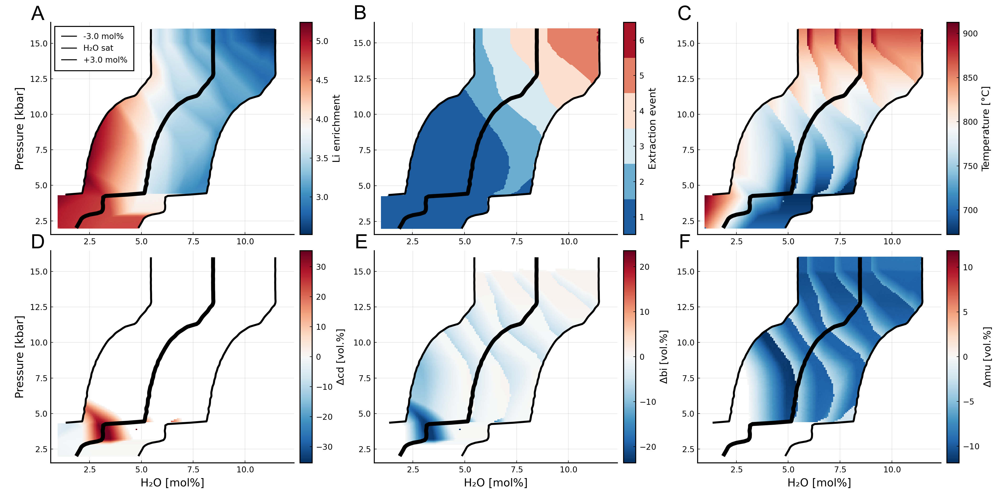

# Thermodynamic modelling of Li enrichment during partial melting: the importance of partition coefficients

```@raw html

```

This section accompanies **Riel et al. (2026, Geochemistry, Geophysics, Geosystems)** and provides fully reproducible tutorial scripts for modelling lithium (Li) enrichment during partial melting of pelitic rocks. All calculations use `MAGEMin_C.jl` for thermodynamic equilibrium and a custom trace-element partitioning engine built on top of it.

## Scientific context

When crustal rocks partially melt, Li is redistributed between minerals and the melt. This section explores how Li concentrations in granitic melts depend on:

- Pressure and water content of the source rock (P–H₂O space)
- The number and size of successive melt extraction events (fractional melting)
- The natural variability of pelite bulk compositions (Forshaw & Pattison 2023 database)

## Tutorial overview

The tutorials are organized from single-condition diagnostics to large multi-sample sweeps:

!!! info
    - [1. P–H₂O systematics](TUTORIAL_compute_PH2O_systematics.md)
    - [2. P–T extraction curves](TUTORIAL_compute_PT_curves.md)
    - [3. Stepwise batch melting](TUTORIAL_compute_plot_stepwise_batch_melting.md)
    - [4. Biotite Li profiles](TUTORIAL_compute_bi_Li_profiles.md)
    - [5. Phase stability](TUTORIAL_compute_plot_phase_stability.md)
    - [6. Solidus across pelites](TUTORIAL_compute_solidus_FS.md)
    - [7. Li systematics across pelites](TUTORIAL_compute_systematics_FS.md)

!!! tip
    Tutorials 1–4 work on a single representative pelite composition and are good starting points. Tutorials 6–7 require the Forshaw & Pattison (2023) database and are computationally heavier (multi-threaded, ~600 samples).

## Getting started

### 1 — Download the files

Download all scripts into a single directory on your machine (the shared helper files must be in the same folder as the main scripts).

### 2 — Set up the Julia environment

The project ships with a `Project.toml` that pins all required packages. To install them:

```julia-repl
# In the Julia REPL, navigate to the directory containing the scripts
julia> using Pkg
julia> Pkg.activate(".")        # activate the project environment
julia> Pkg.instantiate()        # download and precompile all dependencies
```

Or equivalently from the terminal:

```bash
cd /path/to/scripts
julia --project=. -e "using Pkg; Pkg.instantiate()"
```

### 3 — Run a tutorial script

```bash
# single-threaded scripts (Tutorials 2–4)
julia --project=. compute_PT_curves.jl

# multi-threaded scripts (Tutorials 1, 6–7) — use as many threads as your machine has cores
julia --project=. --threads 8 compute_P-H2O_systematics.jl
```

!!! note
    Tutorials 6 and 7 sweep ~600 pelite compositions and benefit significantly from multi-threading. Set `--threads` to the number of physical cores available (check with `Sys.CPU_THREADS` in Julia).

## Script files

All scripts are available for download below. The shared helper files (`TE_functions.jl`, `TE_fractional.jl`, `plot_figures.jl`) are required by most of the main scripts and should be placed in the same directory.

### Main scripts

| Script | Tutorial |
|--------|----------|
| <a href="https://raw.githubusercontent.com/ComputationalThermodynamics/MAGEMin_C.jl/main/docs/src/Riel_2026_gcubed/compute_P-H2O_systematics.jl" download>`compute_P-H2O_systematics.jl`</a> | Tutorial 1 |
| <a href="https://raw.githubusercontent.com/ComputationalThermodynamics/MAGEMin_C.jl/main/docs/src/Riel_2026_gcubed/compute_PT_curves.jl" download>`compute_PT_curves.jl`</a> | Tutorial 2 |
| <a href="https://raw.githubusercontent.com/ComputationalThermodynamics/MAGEMin_C.jl/main/docs/src/Riel_2026_gcubed/compute_plot_stepwise_batch_melting.jl" download>`compute_plot_stepwise_batch_melting.jl`</a> | Tutorial 3 |
| <a href="https://raw.githubusercontent.com/ComputationalThermodynamics/MAGEMin_C.jl/main/docs/src/Riel_2026_gcubed/compute_bi_Li_profiles.jl" download>`compute_bi_Li_profiles.jl`</a> | Tutorial 4 |
| <a href="https://raw.githubusercontent.com/ComputationalThermodynamics/MAGEMin_C.jl/main/docs/src/Riel_2026_gcubed/compute_plot_phase_stability.jl" download>`compute_plot_phase_stability.jl`</a> | Tutorial 5 |
| <a href="https://raw.githubusercontent.com/ComputationalThermodynamics/MAGEMin_C.jl/main/docs/src/Riel_2026_gcubed/compute_solidus_FS.jl" download>`compute_solidus_FS.jl`</a> | Tutorial 6 |
| <a href="https://raw.githubusercontent.com/ComputationalThermodynamics/MAGEMin_C.jl/main/docs/src/Riel_2026_gcubed/compute_systematics_FS.jl" download>`compute_systematics_FS.jl`</a> | Tutorial 7 |

### Shared helper files

| Script | Role |
|--------|------|
| <a href="https://raw.githubusercontent.com/ComputationalThermodynamics/MAGEMin_C.jl/main/docs/src/Riel_2026_gcubed/TE_functions.jl" download>`TE_functions.jl`</a> | Core trace-element functions (KD setup, water saturation, batch melting) |
| <a href="https://raw.githubusercontent.com/ComputationalThermodynamics/MAGEMin_C.jl/main/docs/src/Riel_2026_gcubed/TE_functions_FS.jl" download>`TE_functions_FS.jl`</a> | Forshaw–Pattison-specific helpers (mol bulk conversion, threaded loop) |
| <a href="https://raw.githubusercontent.com/ComputationalThermodynamics/MAGEMin_C.jl/main/docs/src/Riel_2026_gcubed/TE_fractional.jl" download>`TE_fractional.jl`</a> | Threaded fractional melting engine |
| <a href="https://raw.githubusercontent.com/ComputationalThermodynamics/MAGEMin_C.jl/main/docs/src/Riel_2026_gcubed/plot_figures.jl" download>`plot_figures.jl`</a> | Shared plotting helpers |
| <a href="https://raw.githubusercontent.com/ComputationalThermodynamics/MAGEMin_C.jl/main/docs/src/Riel_2026_gcubed/plot_figures_FS.jl" download>`plot_figures_FS.jl`</a> | Forshaw–Pattison scatter and FS-specific plots |
| <a href="https://raw.githubusercontent.com/ComputationalThermodynamics/MAGEMin_C.jl/main/docs/src/Riel_2026_gcubed/plot_bulk_FS.jl" download>`plot_bulk_FS.jl`</a> | Herron diagram and IDW heatmap (Tutorial 6) |

### Environment file

| File | Description |
|------|-------------|
| <a href="https://raw.githubusercontent.com/ComputationalThermodynamics/MAGEMin_C.jl/main/docs/src/Riel_2026_gcubed/Project.toml" download>`Project.toml`</a> | Julia package environment — lists all dependencies (MAGEMin_C, Plots, PlotlyJS, DataFrames, …) |
