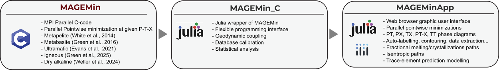

```@raw html
---
# https://vitepress.dev/reference/default-theme-home-page
layout: home

hero:
  name: MAGEMin Toolset
  text: Phase equilibrium modelling
  tagline: A set of tools to compute phase equilibria for Earth-like compositions
  actions:
    - theme: brand
      text: Getting Started
      link: /MAGEMinApp/MAGEMinApp
    - theme: alt
      text: MAGEMin_C.jl API 📚
      link: /api
    - theme: alt
      text: View on GitHub
      link: https://github.com/ComputationalThermodynamics/MAGEMin_C.jl
  image:
    src: /logo_MAGEMin_julia.png
    alt: MAGEMin

features:
  - icon: 🚀
    title: MAGEMinApp
    details: Effortlessly compute phase diagrams and Pressure-Temperature paths
    link: /MAGEMinApp/MAGEMinApp

  - icon: 🛠️
    title: MAGEMin_C
    details: Set of function to freely compute phase equilibrium in Julia
    link: /MAGEMin_C/MAGEMin_C

  - icon: 💻
    title: MAGEMin
    details: C program backend of MAGEMin
    link: /MAGEMin/MAGEMin
---
```

## What is MAGEMin?

`MAGEMin` is a Gibbs energy minimization solver, which computes the thermodynamically most stable assemblage for a given thermodynamic database and a set of bulk-rock composition, pressure and temperature conditions. It returns the fraction of the stable minerals, their compositions and all thermodynamically-derived parameters such as density, thermal expansivity, heat capacity etc. 

`MAGEMin` backend is written as a parallel C library and uses a combination of linear programming, the extended Partitioning Gibbs free Energy approach and gradient-based local minimization to compute the most stable mineral assemblage. In this, it differs from existing approaches which makes it particularly suitable to utilize modern multicore processors.

While `MAGEMin` is the engine for the prediction of the stable phases, it is best used wih the `Julia` interface [MAGEMin_C](https://github.com/ComputationalThermodynamics/MAGEMin_C.jl) and/or the web-browser julia [MAGEMinApp](https://github.com/ComputationalThermodynamics/MAGEMinApp.jl).  


```@raw html


```

## Available thermodynamic database


:::tabs

== Metapelite (W14)

```@raw html
<ul>
    <li>Added March 2023, `MAGEMin v1.3.0`</li>
    <li>White et al., 2014a, 2014b (see http://hpxeosandthermocalc.org)</li>
    <li>K2O-Na2O-CaO-FeO-MgO-Al2O3-SiO2-H2O-TiO2-O-MnO chemical system</li>
    <li>Pure stoichiometric phases quartz (q), cristobalite (crst), tridymite (trd), coesite (coe), stishovite (stv), kyanite (ky), sillimanite (sill), andalusite (and), rutile (ru) and sphene (sph).</li>
    <li>Solution phases spinel (spl), biotite (bi), cordierite (cd), orthopyroxene (opx), epidote (ep), garnet (g), ilmenite (ilm), silicate melt (liq), muscovite (mu),  ternary feldspar (pl4T), sapphirine (sa), staurolite (st), magnetite (mt), chlorite (chl), chloritoid (ctd) and margarite (ma).</li>
</ul>
```

== Ultramafic (EF21)

```@raw html
<ul>
    <li>Added May 2023, `MAGEMin v1.3.2`</li>
    <li>Evans & Frost, 2021 (see http://hpxeosandthermocalc.org)</li>
    <li>SiO2-Al2O3-MgO-FeO-O-H2O-S chemical system</li>
    <li>Pure stoichiometric phases quartz (q), cristobalite (crst), tridymite (trd), coesite (coe), stishovite (stv), kyanite (ky), sillimanite (sill), pyrite (pyr).</li>
    <li>Solution phases fluid (fluid), olivine (ol), brucite (br), antigorite (atg), garnet (g), talc (t), chlorite (chl), spinel (spi), orthopyroxene (opx), pyrrhotite (po) and anthophylite (anth).</li>
</ul>
```

== Metabasite (G16)

```@raw html
<ul>
    <li>Added October 2023, `MAGEMin v1.3.5`</li>
    <li>Green et al., 2016 (see http://hpxeosandthermocalc.org)</li>
    <li>K2O-Na2O-CaO-FeO-MgO-Al2O3-SiO2-H2O-TiO2-O chemical system</li>
    <li>Pure stoichiometric phases quartz (q), cristobalite (crst), tridymite (trd), coesite (coe), stishovite (stv), kyanite (ky), sillimanite (sill), andalusite (and), rutile (ru) and sphene (sph).</li>
    <li>Solution phases spinel (sp), biotite (bi), orthopyroxene (opx), epidote (ep), garnet (g), ilmenite (ilm), silicate melt (liq), muscovite (mu),  ternary feldspar (pl4T), chlorite (chl), Omphacite(omph), Augite(aug) and clino-amphibole (amp).</li>
</ul>
```

== Mantle (H13)

```@raw html
<ul>
    <li>Added October 2024,`MAGEMin v1.5.5`</li>
    <li>Holland et al., 2013 (see https://academic.oup.com/petrology/article/54/9/1901/1514886)</li>
    <li>Na2O–CaO–FeO–MgO–Al2O3–SiO2 (NCFMAS) system</li>
    <li>Pure stoichiometric phases quartz (q), cristobalite (crst), tridymite (trd), coesite (coe), stishovite (stv), kyanite (ky), sillimanite (sill) and andalusite (and).</li>
    <li>Solution phases garnet (g), clinopyroxene (cpx), orthopyroxene (opx) and its high-P polymorph (hpx), olivine (ol), wadsleyite (wad), ringwoodite (ring), akimotoite (ak), MgSi-perovskite (mpv), CaSi–perovskite (cpv), cf, nal, corundum (cor) and ferropericlase (fp)</li>
</ul>
```

== Igneous (G25-HP18)

```@raw html
<ul>
    <li>Added December 2024,`MAGEMin v1.6.2`</li>
    <li>Green et al., 2025, corrected from Holland et al., 2018 (see http://hpxeosandthermocalc.org)</li>
    <li>K2O-Na2O-CaO-FeO-MgO-Al2O3-SiO2-H2O-TiO2-O-Cr2O3 chemical system</li>
    <li>Pure stoichiometric phases quartz (q), cristobalite (crst), tridymite (trd), coesite (coe), stishovite (stv), kyanite (ky), sillimanite (sill), andalusite (and), rutile (ru) and sphene (sph).</li>
    <li>Solution phases spinel (spl), biotite (bi), cordierite (cd), clinopyroxene (cpx), orthopyroxene (opx), epidote (ep), garnet (g), clino-amphibole  (amp), ilmenite (ilm), silicate melt (liq), muscovite (mu), olivine (ol), ternary feldspar (pl4T), and aqueous fluid (fl).</li>
</ul>
```

== Igneous alkaline (W24)

```@raw html
<ul>
    <li>Added December 2024,`MAGEMin v1.6.2`</li>
    <li>Weller et al., 2024 (see doi:10.1093/petrology/egae098)</li>
    <li>K2O-Na2O-CaO-FeO-MgO-Al2O3-SiO2-TiO2-O-Cr2O3 chemical system</li>
    <li>Pure stoichiometric phases quartz (q), cristobalite (crst), tridymite (trd), coesite (coe), stishovite (stv), kyanite (ky), sillimanite (sill), andalusite (and), rutile (ru) and sphene (sph). </li>
    <li>Solution phases spinel (spl), clinopyroxene (cpx), orthopyroxene (opx), garnet (g), ilmenite (ilm), silicate melt (liq), olivine (ol), ternary feldspar (pl4T), Nepheline (ness), Kalsilite (kals), Leucite (lct) and Melilite (mel).</li>
</ul>
```

== Mantle (SB11)

```@raw html
<ul>
    <li>Added May 2025,`MAGEMin v1.7.7`</li>
    <li>Stixrude and Lithgow-Bertelloni, 2011 (see doi.org/10.1111/j.1365-246X.2010.04890.x)</li>
    <li>Na2O–CaO–FeO–MgO–Al2O3–SiO2 (NCFMAS) system</li>
    <li>Pure stoichiometric phases quartz (qtz), coesite (coe), stishovite (st), kyanite (ky), nepheline (neph) and kyanite (ky). </li>
    <li>Solution phases plagioclase (pl), spinel (sp), olivine (ol), wadsleyite (wa), ringwoodite (ri), orthopyroxene (opx), clinopyroxene (cpx), hp-clinopyroxene (hpcpx), akimotoite (ak), garnet (gtmk), perovskite (pv), post-perovskite (ppv), magnesio-wustite (mw) and ca-ferrite (cf) </li>
</ul>
```

== Mantle (SB21)

```@raw html
<ul>
    <li>Added May 2025,`MAGEMin v1.7.7`</li>
    <li>Stixrude and Lithgow-Bertelloni, 2021 (see doi.org/10.1093/gji/ggab394)</li>
    <li>Na2O–CaO–FeO–MgO–Al2O3–SiO2 (NCFMAS) system</li>
    <li>Pure stoichiometric phases quartz (qtz), coesite (coe), stishovite (st), kyanite (ky), nepheline (neph) and kyanite (ky). </li>
    <li>Solution phases plagioclase (pl), spinel (sp), olivine (ol), wadsleyite (wa), ringwoodite (ri), orthopyroxene (opx), clinopyroxene (cpx), hp-clinopyroxene (hpcpx), akimotoite (ak), garnet (gtmk), perovskite (pv), post-perovskite (ppv), magnesio-wustite (mw), new-aluminium-phase (nal) and ca-ferrite (cf) </li>
</ul>
```

:::

!!! note
    Please keep in mind that the datasets are only calibrated for a limited range of `P`,`T` and `bulk rock` conditions. If you go too far outside those ranges, `MAGEMin` (or most other thermodynamic software packages for that matter) may not converge or give bogus results. Developing new, more widely applicable, thermodynamic datasets is a huge research topic, which will require funding to develop the models themselves, as well as to perform targeted experiments to calibrate those models.

## Citation
An open-acces paper describing the methodology is published in G-cubed:

- Riel N., Kaus B.J.P., Green E.C.R., Berlie N., (2022) MAGEMin, an Efficient Gibbs Energy Minimizer: Application to Igneous Systems. *Geochemistry, Geophysics, Geosystems* 23, e2022GC010427 [https://doi.org/10.1029/2022GC010427](https://doi.org/10.1029/2022GC010427)

## Fundings
Development of this software package was funded by the European Research Council under grant ERC CoG #771143 - [MAGMA](https://magma.uni-mainz.de), and is currently supported by German Research Foundation (DFG) - Project number #521637679  

## References

- Green, ECR, Holland, TJB, Powell, R, Weller, OM, & Riel, N (2025). Journal of Petrology, 66, doi: 10.1093/petrology/egae079

- Weller, OM, Holland, TJB, Soderman, CR, Green, ECR, Powell, R, Beard, CD & Riel, N (2024). New Thermodynamic Models for Anhydrous Alkaline-Silicate Magmatic Systems. Journal of Petrology, 65, doi: 10.1093/petrology/egae098

- Holland, TJB, Green, ECR & Powell, R (2022). A thermodynamic modelfor feldspars in KAlSi3O8-NaAlSi3O8-CaAl2Si2O8 for mineral equilibrium calculations. Journal of Metamorphic Geology, 40, 587-600, doi: 10.1111/jmg.12639

- Tomlinson, EL & Holland, TJB (2021). A Thermodynamic Model for the Subsolidus Evolution and Melting of Peridotite. Journal of Petrology,62, doi: 10.1093/petrology/egab012

- Holland, TJB, Green, ECR & Powell, R (2018). Melting of Peridotitesthrough to Granites: A Simple Thermodynamic Model in the System KNCFMASHTOCr. Journal of Petrology, 59, 881-900, doi: 10.1093/petrology/egy048

- Green, ECR, White, RW, Diener, JFA, Powell, R, Holland, TJB & Palin, RM (2016). Activity-composition relations for the calculationof partial melting equilibria in metabasic rocks. Journal of Metamorphic Geology, 34, 845-869, doi: 10.1111/jmg12211

- White, RW, Powell, R, Holland, TJB, Johnson, TE & Green, ECR (2014). New mineral activity-composition relations for thermodynamic calculations in metapelitic systems. Journal of Metamorphic Geology, 32, 261-286, doi: 10.1111/jmg.12071

- Holland, TJB & Powell, RW (2011). An improved and extended internally consistent thermodynamic dataset for phases of petrological interest, involving a new equation of state for solids. Journal of Metamorphic Geology, 29, 333-383, doi: 10.1111/j.1525-1314.2010.00923.x
