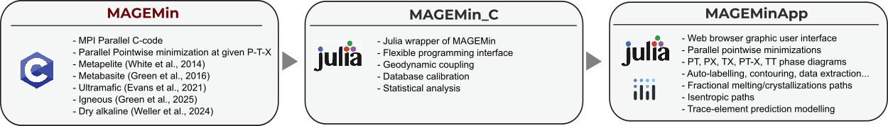

```@raw html
---
# https://vitepress.dev/reference/default-theme-home-page
layout: home

hero:
  name: MAGEMin Toolset
  text: Phase equilibrium modelling
  tagline: A set of tools to compute phase equilibria for Earth-like compositions
  actions:
    - theme: brand
      text: Getting Started
      link: /MAGEMinApp/MAGEMinApp
    - theme: alt
      text: MAGEMin_C.jl API 📚
      link: /api
    - theme: alt
      text: View on GitHub
      link: https://github.com/ComputationalThermodynamics/MAGEMin_C.jl
  image:
    src: /logo_MAGEMin_julia.png
    alt: MAGEMin

features:
  - icon: 🚀
    title: MAGEMinApp
    details: Effortlessly compute phase diagrams and Pressure-Temperature paths
    link: /MAGEMinApp/MAGEMinApp

  - icon: 🛠️
    title: MAGEMin_C
    details: Set of functions to freely compute phase equilibrium in Julia
    link: /MAGEMin_C/MAGEMin_C

  - icon: 💻
    title: MAGEMin
    details: C program backend of MAGEMin
    link: /MAGEMin/MAGEMin
---
```

## What is MAGEMin?

`MAGEMin` is a Gibbs energy minimization solver, which computes the thermodynamically most stable assemblage for a given thermodynamic database and a set of bulk-rock composition, pressure and temperature conditions. It returns the fraction of the stable minerals, their compositions and all thermodynamically-derived parameters such as density, thermal expansivity, heat capacity etc. 

`MAGEMin` backend is written as a parallel C library and uses a combination of linear programming, the extended Partitioning Gibbs free Energy approach and gradient-based local minimization to compute the most stable mineral assemblage. In this, it differs from existing approaches which makes it particularly suitable to utilize modern multicore processors.

While `MAGEMin` is the engine for the prediction of the stable phases, it is best used with the `Julia` interface [MAGEMin_C](https://github.com/ComputationalThermodynamics/MAGEMin_C.jl) and/or the web-browser julia [MAGEMinApp](https://github.com/ComputationalThermodynamics/MAGEMinApp.jl).  


```@raw html


```

## Available thermodynamic databases

`MAGEMin` ships 13 thermodynamic databases - `mp`, `um`, `mb`, `mtl`, `ig`, `igad`, `sb11`, `sb21`, `sb24`, `ume`, `mpe`, `mbe`, and `all` (a master database unifying every unique solution-phase model across mp/mb/mbe/ig/igd/igad/um/ume/mpe) - plus the DEW aqueous fluid model, available in `all` and several of the single-system databases.

**→ See the full [Databases information](database.md) page** for the acronym reference table, per-database chemical systems, phase/end-member listings, and the DEW aqueous fluid model section.

!!! note
    Please keep in mind that the datasets are only calibrated for a limited range of `P`,`T` and `bulk rock` conditions. If you go too far outside those ranges, `MAGEMin` (or most other thermodynamic software packages for that matter) may not converge or give bogus results. Developing new, more widely applicable, thermodynamic datasets is a huge research topic, which will require funding to develop the models themselves, as well as to perform targeted experiments to calibrate those models.

## Citation
An open-access paper describing the methodology is published in G-cubed:

- Riel N., Kaus B.J.P., Green E.C.R., Berlie N., (2022) MAGEMin, an Efficient Gibbs Energy Minimizer: Application to Igneous Systems. *Geochemistry, Geophysics, Geosystems* 23, e2022GC010427 [https://doi.org/10.1029/2022GC010427](https://doi.org/10.1029/2022GC010427)

## Fundings
Development of this software package was funded by the European Research Council under grant ERC CoG #771143 - [MAGMA](https://magma.uni-mainz.de), and is currently supported by German Research Foundation (DFG) - Project number #521637679  

## References

- Green, E.C.R., Holland, T.J.B., Powell, R., Weller, O.M., & Riel, N. (2025). Journal of Petrology, 66. [doi: 10.1093/petrology/egae079](https://doi.org/10.1093/petrology/egae079)

- Weller, O.M., Holland, T.J.B., Soderman, C.R., Green, E.C.R., Powell, R., Beard, C.D., & Riel, N. (2024). New Thermodynamic Models for Anhydrous Alkaline-Silicate Magmatic Systems. Journal of Petrology, 65. [doi: 10.1093/petrology/egae098](https://doi.org/10.1093/petrology/egae098)

- Holland, T.J.B., Green, E.C.R., & Powell, R. (2022). A thermodynamic model for feldspars in KAlSi₃O₈-NaAlSi₃O₈-CaAl₂Si₂O₈ for mineral equilibrium calculations. Journal of Metamorphic Geology, 40, 587-600. [doi: 10.1111/jmg.12639](https://doi.org/10.1111/jmg.12639)

- Tomlinson, E.L., & Holland, T.J.B. (2021). A Thermodynamic Model for the Subsolidus Evolution and Melting of Peridotite. Journal of Petrology, 62. [doi: 10.1093/petrology/egab012](https://doi.org/10.1093/petrology/egab012)

- Holland, T.J.B., Green, E.C.R., & Powell, R. (2018). Melting of Peridotites through to Granites: A Simple Thermodynamic Model in the System KNCFMASHTOCr. Journal of Petrology, 59, 881-900. [doi: 10.1093/petrology/egy048](https://doi.org/10.1093/petrology/egy048)

- Green, E.C.R., White, R.W., Diener, J.F.A., Powell, R., Holland, T.J.B., & Palin, R.M. (2016). Activity-composition relations for the calculation of partial melting equilibria in metabasic rocks. Journal of Metamorphic Geology, 34, 845-869. [doi: 10.1111/jmg12211](https://doi.org/10.1111/jmg12211)

- White, R.W., Powell, R., Holland, T.J.B., Johnson, T.E., & Green, E.C.R. (2014). New mineral activity-composition relations for thermodynamic calculations in metapelitic systems. Journal of Metamorphic Geology, 32, 261-286. [doi: 10.1111/jmg.12071](https://doi.org/10.1111/jmg.12071)

- Holland, T.J.B., & Powell, R.W. (2011). An improved and extended internally consistent thermodynamic dataset for phases of petrological interest, involving a new equation of state for solids. Journal of Metamorphic Geology, 29, 333-383. [doi: 10.1111/j.1525-1314.2010.00923.x](https://doi.org/10.1111/j.1525-1314.2010.00923.x)

- Stixrude, L., & Lithgow-Bertelloni, C. (2011). Thermodynamics of mantle minerals - II. Phase equilibria. Geophysical Journal International, 184, 1456-1475. [doi: 10.1111/j.1365-246X.2010.04890.x](https://doi.org/10.1111/j.1365-246X.2010.04890.x)

- Stixrude, L., & Lithgow-Bertelloni, C. (2021). Thermal expansivity, heat capacity and isothermal compressibility of the mantle. Geophysical Journal International, 228, 1296-1314. [doi: 10.1093/gji/ggab394](https://doi.org/10.1093/gji/ggab394)

- Stixrude, L., & Lithgow-Bertelloni, C. (2024). Thermodynamics of mantle minerals – III: the role of iron. Geophysical Journal International, 237(3), 1699-1733. [doi: 10.1093/gji/ggae126](https://doi.org/10.1093/gji/ggae126)

- Evans, K.A., & Frost, B.R. (2021). Deserpentinization in Subduction Zones as a Source of Oxidation in Arcs: a Reality Check. Journal of Petrology, 62(3), egab016. [doi: 10.1093/petrology/egab016](https://doi.org/10.1093/petrology/egab016)

- Diener, J.F.A., Powell, R., White, R.W., & Holland, T.J.B. (2007). A new thermodynamic model for clino- and orthoamphiboles in the system Na₂O-CaO-FeO-MgO-Al₂O₃-SiO₂-H₂O-O. Journal of Metamorphic Geology, 25, 631-656.

- Rebay, G., Powell, R., & Diener, J.F.A. (2022). New activities for the system FeO-MgO-Al₂O₃-SiO₂ with applications to metamorphic rocks. Journal of Metamorphic Geology.

- Franzolin, E., Schmidt, M.W., & Poli, S. (2011). Ternary Ca–Fe–Mg carbonates: subsolidus phase relations at 3.5 GPa and a thermodynamic solid solution model including order/disorder. Contributions to Mineralogy and Petrology, 161(2), 213-227.
