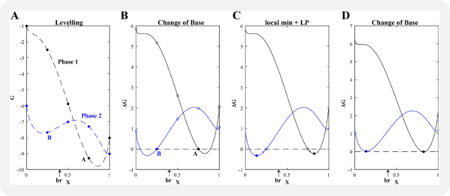
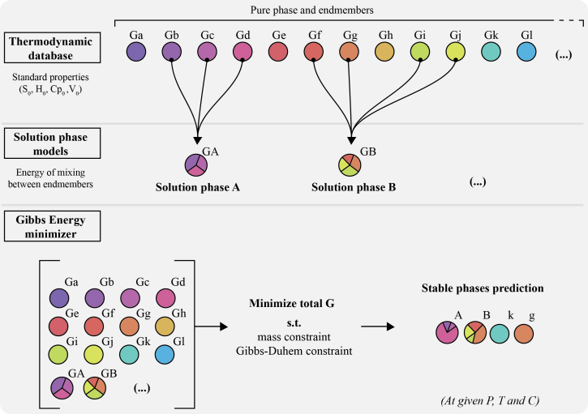

```@raw html

```

## Problem Definition

Finding the most stable phase assemblage is a challenging constrained optimization problem including both equality and inequality constraints. One has to minimize the Gibbs energy (1) of the system while satisfying the Gibbs-Duhem (2) and mass equality constraints (3) while also satisfying the mixing-in-sites inequality constraints (4).

### 1. Total Gibbs Energy

The Gibbs energy of a multi-component multiphase system is given by the weighted summation of the chemical potentials of all end-members and pure phases:

$\begin{align}
G_{sys} = \sum_{\lambda=1}^{\Lambda} n_{\lambda} \sum_{i=1}^{N_{\lambda}} \mu_{i}(\lambda) p_{i}(\lambda) + \sum_{\omega=1}^{\Omega} n_{\omega} \mu_{\omega}
\end{align}$

where $n_{\lambda}$ is the molar fraction of the solution phase, $p_{\lambda}$ is the molar fraction of the endmembers, and $n_{\omega}$ is the molar fraction of the pure phase.

The chemical potential of a phase is either a constant for a condensed (pure) phase:

$\begin{align}
\mu_{i} = G_{i}^{0}
\end{align}$

or a function for a phase within a solution:

$\begin{align}
\mu_{i} = G_{i}^{0} + RT\log(a_{i}) + G_{i}^{ex}
\end{align}$

where $a_{i}$ is the thermochemical activity related to the mole fraction and the activity coefficient by:

$\begin{align}
a_{i} = x_{i} \gamma_{i}
\end{align}$

For the case of ideal mixing between the end-members, the activity coefficient is unity. The mixing of a species dissolved in a condensed phase, however, rarely behaves ideally and is typically a function of both temperature and composition (mixing-on-sites formulation).

### 2. Gibbs-Duhem Constraint

The Gibbs-Duhem constraint is defined as:

$\begin{align}
\sum_{j=1}^{C} \Gamma_{j} a_{ij} - \mu_{i} = 0
\end{align}$

where $\Gamma_{j}$ is the chemical potential of pure component (oxide) $j$ and $a_{ij}$ is the molar composition of component $j$ in end-member/pure phase $i$.

### 3. Mass Constraint

The mass equality constraint is defined as:

$\begin{align}
\sum_{\lambda=1}^{\Lambda} n_{\lambda} \sum_{i=1}^{N_{\lambda}} a_{ij}(\lambda) p_{i}(\lambda) + \sum_{\omega=1}^{\Omega} n_{\omega} a_{\omega j} - b_j = 0
\end{align}$

where $a_{ij}$ is the molar composition of component $j$ in end-member $i$, and $a_{\omega j}$ is the molar composition of component $j$ in a pure phase.

## Minimization Approach

The Gibbs minimization approach employed in MAGEMin combines discretization of the equations of state in composition space with linear programming and extends the mass-constrained Gibbs-hyperplane rotation method to account for the mixing-on-sites that takes place in silicate mineral solid solutions. For an exhaustive description of the methodology, see Riel et al. (2022).

```@raw html

  

```  

## Algorithm Demonstration

A simplified example of the Gibbs energy minimization approach used in MAGEMin is provided at:

[GitHub Repository](https://github.com/ComputationalThermodynamics/SandBox/blob/main/PhaseEquilibriumMinimizer/MAGEMin_PGE_and_LP.m)

This MATLAB application includes two pure phases, sillimanite and quartz, and activity-composition (a-x) relations for feldspar (pl4T, Holland et al., 2021) in a reduced Na2O-CaO-K2O-Al2O3-SiO2 (NCKAS) chemical system.

## References

- Holland, T. J. B., Green, E. C. R., & Powell, R. (2021). A thermodynamic model for feldspars in KAlSi3O8-NaAlSi3O8-CaAl2Si2O8 for mineral equilibrium calculations.

- Riel N., Kaus B.J.P., Green E.C.R., Berlie N., (2022) MAGEMin, an Efficient Gibbs Energy Minimizer: Application to Igneous Systems. *Geochemistry, Geophysics, Geosystems* 23, e2022GC010427 [https://doi.org/10.1029/2022GC010427](https://doi.org/10.1029/2022GC010427)
